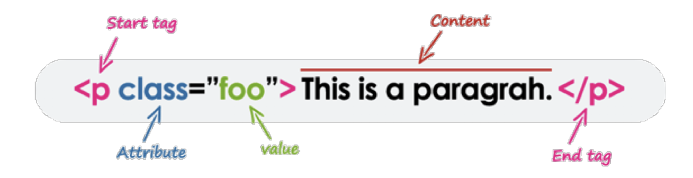
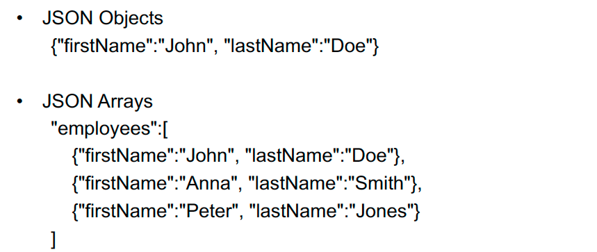

# COMP20008 Elements of Data Processing Summary
## Lecture 1 Introduction
- **Data Wrangling**
	- What is data wrangling
	- What activities the it encompasses
	- Why it is done
	- Why it is challenging
	- Why it is useful
	- Appreciate the series of activities in data wrangling (the data wrangling pipeline)

## Lecture 2 & 3 Data Formats
- **Data formats**
	- Structured: Relational Database, CSV
	- Unstructured: text
	- Semi-structured: HTML, XML, JSON
- **Benefits for having structure of data**
	- Easier to analyse, easier to query
	- Easier to store
	- Easier to clean, maintain consistency and security, especially with multiple users
- **Comma Separated Value(CSV)**
	- Spreadsheet
	- Easy to use
	- Structured, but not like a relational DB
- **Difference between CSV and spreadsheet**
	- CSV is a plain text format. Spreadsheet often refers to XLS file which is a binary file format
- **Text**
	- No Structure
	- Hard to index
	- Hard to organize
	- Lacks regularity and decomposable internal structure
- **Regular Expression**
	- Syntax
		- '.'    Any characters
		- '^'   Beginning of a string
		- '$'   End of a string
		- '\*'  Zero or more repetitions
		- '\+'  One or more repetitions
		- '|'     The or operator, used in conjunction with parentheses()
		- '[]'    A set of characters, e.g. [abcd], [a-zA-Z]
		- '[^]' Complement of a set of characters
			- [^a-z] matches any characters except a-z
		- Group text with parentheses
			- xy|z != x(y|z)
		- '()' Groups text
		- 'JA' The pattern: 'J' immediately followed by 'A'
		- 'JA*' The pattern: 'J' followed by zero or more occurence of 'A'
		- '(J|A)*' Zero or more repetitions of 'J' or 'A's
		- '(J|A)+' One or more repetitions of 'J' or 'A's
		- Email format:   [a-zA-Z0-9_.+-]+@[a-zA-Z0-9-]+(\.[a-zA-Z0-9-]+)+
	- **HTML(HyperText Markup Language)**
		- Markup with elements, delineated by start and end tags. Elements correspond to logic units such as heading, paragraph or itemised list
		- Tags: Keywords contained in pairs of angle brackets
		- Browser determines how to display/present the logical units
		- Not all elements need both start and end tags
		- Some elements can have attributes. The order of attributes is not important
		
	- **Limitation of HTML**
		- HTML was designed for pure presentation
		- HTML is concerned with formatting not meaning
		- HTML is not extensible
			- can't be modified to meet specific domain knowledge
			- browsers have developed their own tags
		- HTML can be inconsistently applied
			- almost everything is rendered somehow
	- **XML(Extensible Markup Language)**
		- Extensible: Users define tags
		- Facilitate better encoding of semantics
		- It was designed to store and transport data
		- It was designed to be self-descriptive
		- XML files must begin with declaration
			`<?xml version="1.0"?>`
		-  XML elements
			- Start/end tags or Empty tags
			- Attributes in quotes
				- \<campus> Parkville \</campus>
				- \<campus location = "Parkville" />
			- Appropriately nested
			- One root element
		- Comments
			- `<!-- comments do not affect the document -->`
		- Some characters have special meaning
			- '<' and '&' are strictly illegal inside an element
		- CDATA(character data) section may be used inside XML element to include large blocks of text, which may contain these special characters such as &, >
	- **(Exam Question)Difference between HTML and XML**
		- XML was developed to describe data and focalise on what the data represent; HTML was developed to display data and foculise on the way data looks
		- XML is about describing information; HTML is about displaying information
		- XML is extensible, users have possibility to define personal structures and tags; The tags and structures of HTML are predefined
	- **(Exam Question)Purpose of XML namespace**
		- To avoid name conflicts by differentiating elements and attributes within an XML document that may have identical name but different definitions
	- **Namespace Scope**
		- The scope of a namespace declaration is
			- The element that contains the namespace declaration
			- All its descendants(i.e. nested within the element)
			- The declaration may be overridden by further nested namespace declarations
		- Namespaces can be used to describe *both elements and attributes*. Elements without a namespace prefix are defined a default namespace
	- **XML schema & validation**
		- An XML file can be well-formed and NOT valid; it is valid if it is consistent with a particular schema
		- XML Schema languages, example:
			- XSD(XML Schema Definitions): a W3C standard
			- DTD(Document Type Definitions)
		- HTML5 schema for Web browser <!DOCTYPE html>
	- **XML parsers**
		- Document Object Model(DOM)
			- Programming interface for XML and HTML
			- Most useful way of parsing XML
			- Parsing calls load the document into a tree structure with different nodes that can be navigated by the program
		- Simple API for XML (SAX)
			- Stream-based way of reading XML (sequential)
			- Fast and efficient if you don't need random-access
			- Memory efficient
	- **JSON(JavaScript Object Notation)**
		- Object data is in name/value pairs
			- "firstName" : "John"
		- JSON values
			- A number (integer or floating point)
			- A string (in double quotes)
			- A Boolean (true or false)
			- An array (in square brackets)
			- An object (in curly braces)
			- null
			
	- **(Exam Question)Comparison between JSON and XML**
		- JSON is simpler and more compact/lightweight than XML. Easy to parse
		- Common JSON application - read and display data from a web server using Javascript
		- XML comes with a large family of other standards for querying and transforming (XQuery, XML Schema, XPATH, XSLT, namespaces, ...)
		- XML allows complex schema definitions (via regular expressions)
			- allows formal validation
			- makes you consider the data design more closely
		- JSON is more streamlined, lightweight and compressed
			- Which appeals to programmers looking for speed and efficiency
			- widely used for storing data in noSQL databases
	- **JSON Schema**
		- Written in JSON itself
		- Describes the structure of other data
		- Easy to validate a JSON document against its schema using a schema validator

## Lecture 4 & 5 Data cleaning: missing values and outliers detection

## Lecture 5: Recommender Systems

## Lecture 6: Data visualisation

## Lecture 7: Clustering and clustering visualisation

## Lecture 8: Hierarchical clustering and dimension reduction

## Lecture 9: Assessing correlations

## Lecture 10: Mutual information

## Lecture 11: Guest Lecture

## Lecture 12 & 13: Classification and regression techniques: decision tree and k-nearest neighbor

## Lecture 14: No Lecture(Good Friday)

## Lecture 15 & 16: Blockchain and data processing

## Lecture 17: Guest Lecture

## Lecture 18 & 19 & 20: Data linkage and privacy

## Lecture 21: Public data release and individual anonymity

## Lecture 22: Differential privacy

## Lecture 23: Ethical consideration

## Lecture 24: Wrap up
