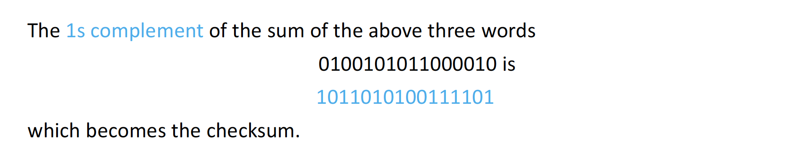
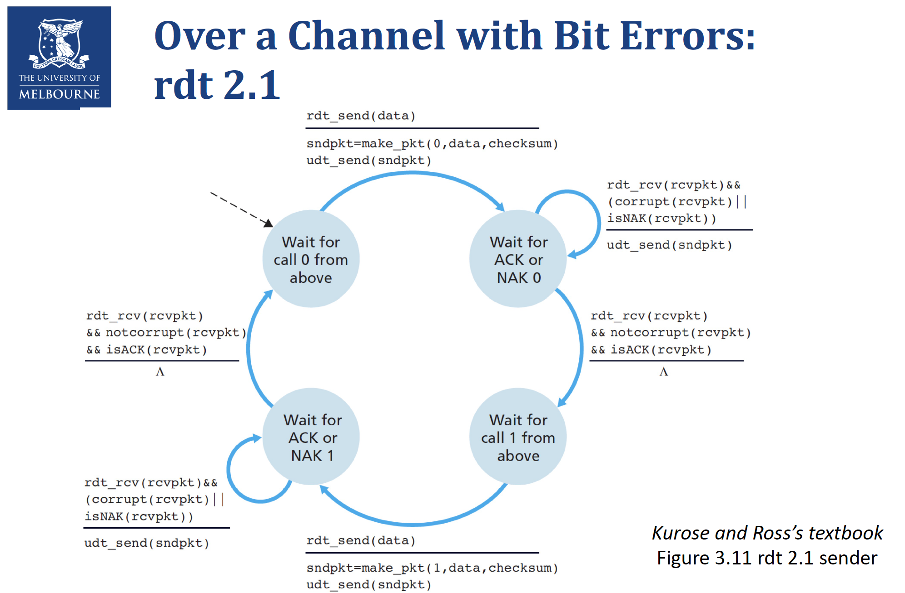
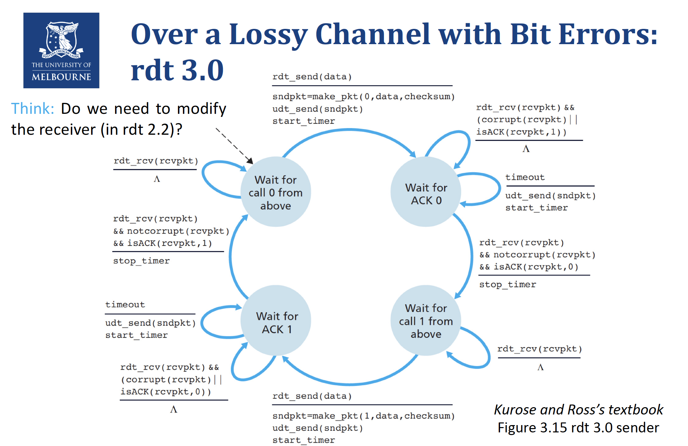

# COMP30023 Computer Systems Summary

## Some points
- Even though the course name is called "Computer Systems", the course mainly focus on computer networks introducing in top-down approach
- Knowledge intensive
- Programming part
	- Project 1 focus on socket programming
	- Project 2 focus on crack the user passwords(cryptography)


## Week 1 Lecture 1
- **What is Internet?**
	- Internet is a network that interconnects with hundreds of millions of computing devices
	- These devices are called *end systems* or *hosts*
- **Connection: End Systems - Routers - Modems - ISP**
	- ISP: Internet Services Providers(Telstra, TPG, etc.)
	- Packets: Information sent through the communication links
- **Protocols: defines the format and order of messages exchanged between different communicating entities, as well as the action taken on the transmission or receipt of a message or other events**
	- All activities in the internet involves two or more communicating remote entities is governed by protocols
	-  The communication between different entities requires different protocols
- **Layering model:**
	- Each layer offers services to the layer directly above it by:
		- Performing certain actions within the layer
		- Using the services by the layer directly below it
	- Strength:
		- An abstract way to represent the whole system
		- People at a layer
			- Only focus on the services provided to the upper layer
			- Only need to know the API's of the lower layer
			- Do not need to know the implementation details of all other layers
	- Drawbacks:
		- Introduce overheads
		- Inefficient and has delays
		- Increase the chance to make errors
- **Service Models:**
	- TCP/IP Model: Application Layer - Transport Layer - Network Layer - Link Layer - Physical Layer
	- OSI Model(Open Systems Interconnection): Application Layer - Presentation Layer - Session Layer - Transport Layer - Network Layer - Link Layer - Physical Layer


## Week 1 Lecture 2 - Application Layer
- **Overview of TCP/IP Model**
	- **Application Layer**
		- The packets of information at this layer are called *messages*
		- It includes network applications and their application-layer protocols
		- Main protocols:
			- HTTP(HyperText Transfer Protocol): Web
			- FTP(File Transfer Protocol): File Transfer between end systems
			- SMTP(Simple Mail Transfer Protocol): email
			- DNS(Domain Name Systems): network-name to network-address translation
		- The application in one end system uses the protocol to exchange packets of information with the application in another end system
	- **Transport Layer**
		- The packets of information at this layer are called *segment*
		- It transports application-layer message between application endpoints
		- Main protocols:
			- TCP(Transmission Control Protocol):
				- Connection-Oriented Services
				- Reliable
			- UDP(User Datagram Protocol):
				- Connectionless Services
				- Unreliable
	- **Network Layer**
		- The packets of information at this layer are called *datagram*
		- It is responsible for moving network-layer packets from one end system to another end system
		- Main protocols:
			- IP(Internet Protocol)
				- It defines the fields in packets
				- It defines how the end systems and routers act on these fields
				- All Internet components have Internet layer *must run the IP protocol*
			-  Routing Protocol
				- It *determines the routes* the packets take between source and destination
				- The network layer routes a packet through a series of routers between the source and the destination
				- To move the packet from one node to the next node in the route, the network layer needs to *pass the datagram down* to the link layer
	- **Link Layer**
		- The packets of information at this layer are called *frame*
		- It delivers the packets to the next nodes along the route
		- The delivery services depends on specific link-layer protocol that is employed over the link, which means they are *link dependent*
	- **Physical Layer**
		- While the job of the link layer is to move the entire frame from one network element to the next element in the route, the job of the physical layer is to move the individual bits within the frames from the network element to the next
		- The protocols at this layer are also link dependent and further depend on the actual transmission medium of the link
- The Application layer, Transport layer, Network layer are end to end
- The Link layer, Physical layer are point to point
- **Overview of the OSI(Open Systems interconnection) model**
	- Except for layer 5, 6, all other layers have roughly the same functionalities as TCP/IP model
	- **Presentation Layer**
		- To provide services that allow communicating application to *interpret the meaning of the data exchanged*
		- The service includes data compression, data encryption, data description
		- It allows the application not to worry about the internal format in which data are represented and stored
	- **Session Layer**
		- It provides for delimiting and synchronization of data exchange, including the means to build a checkpointing and recovery scheme
- **Application Layer in depth**
	- Sockets
		- The interface between the application layer and the transport layer
		- Applications send and receive message through sockets
		- Each socket has a *unique identifier*
		- The format of the identifier depends on what transport-layer protocol is used(whether UDP or TCP)
		- Each transport-layer segment has a set of fields for identifying sockets
	- HTTP
		- The HTTP needs to be implemented in two programs: client program and server program
		- The client program and the server program are executing on the different end systems and talk to each other by exchanging HTTP messages
		- *Web page*: a document consisting of objects
		- *Object*: a file that is addressable by URL, such as a HTML file, a JPEG image, a JAVA applet, and a video clip
		- *URL(Uniform Resource Locator)*: consists of
			1. the *hostname* of the server that houses the objects
			2. the objects *path name*
			
		- Web browsers implement the client side of HTTP while the web servers implement the server side of HTTP
		- Most web pages include a base html file and several referenced objects
- **Two types of connections of TCP**
	- Non-persistent connection: Each request and response pair is sent over a separate TCP connection
		- For each objects, it requires **two** "round trip time"(One to *initiates the TCP connection* and one for *HTTP request*) plus the *file transmission time*
		- For each TCP connection, it causes OS *overhead* because TCP buffers must be allocated and the TCP variables must be kept in both client and server
		- Browsers often open *parallel* TCP connections to fetch referenced objects  
	- Persistent connection: All the requests and responses are sent over the same TCP connection
		- The default option for HTTP
		- Server leaves connection open after sending response. The connection closes if it is not used for certain amount of time(configurable)
		- Subsequent HTTP messages between the same client server are sent over the open connection
		- client can send request as soon as it encounters a referenced object, without waiting for replies to pending requests(pipelining)
- **How Non-persistent connection works when open the url http://www.someuni.edu.au/somedepartment/home.index**
	1. The HTTP client initiates a TCP connection(via its socket) to the server www.someuni.edu.au on port *80*(the default port number for HTTP)
	2. The HTTP server process accepts the connection requests and send a *response message*(via its socket)
	3. The HTTP client process sends a HTTP *request message*(via its socket) to the HTTP server. The request message includes the path name /somedepartment/home.index
	4. The HTTP server process:
		1. receives the request message(via its socket)
		2. retrieves the objects at the path name /somedepartment/home.index
		3. encapsulate the object in an HTTP *response message*
		4. send it to the client(via its socket)
	5. The HTTP server process tells the TCP to close the TCP connection. But the TCP does not actually terminate the connection until it knows for sure the client has received the response message intact
	6. The HTTP client receives the response message(via its socket). The TCP connection terminates. The message indicates that the encapsulated objects is an HTML file. The client:
		1. Extracts the HTML file from the message
		2. Examine the HTML file
		3. Find reference to all other objects
	7. The first four steps are then repeated for each of the referenced objects
- **HTTP Message**
	- HTTP Request Message Format
		
		- Request line: method | URL | Version
		- Request methods:
			- GET: Request an object in the specific URL
			- POST: It is used when the user fills out the form
			- HEAD: Detect whether an object can be requested successfully
			- PUT: It allows a user to upload an object to a specific path on a specific Web server
			- DELETE: It allows a user to delete an object on a Web server
	- HTTP Response Message Format
		
		- Status line: version | status code | phrase
		- HTTP response code:
			- 1xx: Information
				- 100 - Server agrees to handle client's request
			- 2xx: Success
				- 200 - Request succeeded
				- 204 - No content present
			- 3xx: Redirection
				- 301 - Page moved
				- 304 - Cached page still valid
			- 4xx: Client error
				- 403 - Forbidden page
				- 404 - Page not found
			- 5xx: Server error
				- 500 - Internal server error
				- 503 - Try again later
- **Cookie**
	- Background: HTTP is a *stateless* protocol. An HTTP server maintains no information about the clients. For allowing Web servers to identify users, HTTP uses *cookies*
	- The cookie has four components:
		1. A *cookie header line* in HTTP response message
		2. A *cookie header line* in HTTP request message
		3. A *cookie file* kept on user's end system and managed by the user's browser
		4. A back-end *database* at the Web site


## Week 2 Lecture 1 - Application Layer
- **File Transfer Protocol(FTP)**
	- In a typical FTP session, the user is *local host* and wants to transfer files to and from a *remote host*
	- FTP uses two parallel TCP connections to transfer a file:
		- Control connection:
			-  Sending control information between the two hosts including:
				- User identification, Password, Commands to change remote directory, Commands to "put" and "get" files
			- At the beginning, the client side initiates a TCP control connection to the server on port 21
			- The client side sends the user identification, password as well as the commands over this control connection during the entire FTP session(Persistent)
			- The commands and replies are sent over the control connection in 7-bit ASCII format.
			- Each command consists of four uppercase ASCII characters, some with optional arguments. Some common commands:
				- USER *username*: Used to send the user identification to the server
				- PASS *password*: Used to send user password to the server
				- LIST: Used to send back a list of all the files in the current remote directory. The list of files is sent over a *new and non-persistent data connection*
				- RETR *filename*: Used to retrieve (i.e., get) a file from the current directory of the remote host
				- STOR *filename*: Used to store (i.e., put) a file into the current directory of the remote host
			- The replies are *three-digit number*, followed by an optional message. Some typical replies:
				- 331 Username OK, password required
				- 125 Data connection already open; transfer starting
				- 425 Can't open data connection
				- 452 Error writing file
		- Data connection:
			- Automatically send a file
			- When the server side receives a command for a file transfer(either to or from the remote host), the server side initiates a TCP data connection to the client side at port 20
			- FTP sends exactly one file over the data connection after which the data connection *will be closed*(Non-persistent)
- **Simple Mail Transfer Protocol(SMTP)**
	- Three major components in email systems:
		- User agents
		- Mail servers
		- Simple Mail Transfer Protocol(SMTP)
	- SMTP: Transfer messages from the *senders' mail servers* to the *recipients' mail servers*
	- Mail message format

	- An overview example of SMTP
		1. Alice composes a message with Bob's email address
		2. Alice's user agent sends the message to her mail server
		3. The client side of SMTP on Alice's mail server opens a *direct persistent TCP connection* to an SMTP server at *port 25* on Bob's mail server
		4. The client side sends the message over the TCP connection
		5. The SMTP server side receives the messages and place it into Bob's mailbox
		6. Bob invokes his user agent to obtain the message at his convenience
	- Comparison between HTTP and SMTP
		- Similarity
			- Both of HTTP and SMTP are used to transfer files from one host to another
			- Both HTTP and SMTP use persistent TCP connection
		- Difference
			- HTTP is mainly a pull protocol. SMTP is primarily a push protocol
			- SMTP requires each message, including the body of the each message to be in *7-bit ASCII format*. HTTP does not has this restriction
			- HTTP encapsulates each object in its own HTTP response message. SMTP places all of message's objects into one message
	- Mail Access Protocol
		- Bob cannot use SMTP to obtain the message. Because SMTP is a push protocol, while obtaining messages is a pull operation
		- To obtain message from mail server, we use Mail Access Protocol:
			- Post Office Protocol - Version 3 (POP3)
			- Internet Mail Access Protocol (IMAP)
			- HTTP
- **Domain Name System(DNS)**
	- An application-layer protocol to *translate user-defined host name to IP address*
	- The DNS adds an additional delay to the Internet Applications that uses it
	- All DNS query and reply messages are sent through UDP datagrams to port 53
	- In addition to translate hostnames to IP addresses, DNS also provides services:
		- Host aliasing
			- A host can have one or more alias names
		- Mail Server aliasing
		- Load distribution
	- Distributed, Hierarchical database of mappings
		- Problems with centralized database
			- A single point of failure
			- Traffic volume
			- Distant centralized database
			- Maintenance
		- DNS uses a large number of servers, organized hierarchical and distributed around world. No single DNS server has all of the mappings for all of the hosts in the Internet. Mappings are distributed around the DNS servers

		- Root DNS Servers:
			- 13 root DNS servers over the world
		- Top-Level Domain(TLD) DNS Servers:
			- Top-level domain such as *com*, *org*, *net*, *edu* and *gov*
			- All of the country top-level domains such as *au*, *uk*, *fr*, *ca* and *jp*
		- Authoritative DNS Server
			- Every organization with publicly accessible on the internet *must* provide publicly accessible DNS records that maps the name of those hosts to IP addresses
			- An organization DNS server houses these DNS records
		- Local DNS Server
			- Each ISP, such as an university, an company or a residential ISP has a local DNS server (also called a default name server)
			- When a host makes a DNS query, the query is sent to the local DNS server, which acts like a proxy, forwarding the query into the DNS server hierarchy


## Week 2 Lecture 2 - Git
- **Version Control**
	- Version control is a system that records the changes to a file or set of files over time so that we can recall specific version later
	- Local Version Control System
		- Duplicate files in different directories
	- Centralized Version Control Systems(CVCS)
		- A single server contains all the version files, and a number of clients that check out files from that central place
			- CVS
			- SVN
			- Perforce
	- Distributed Version Control Systems(DVCS)
		- Clients don't just check out the latest snapshot of the files; rather, they fully mirror the repository, including its full history
			- Git
			- Mercurial
			- Bazaar
			- Darcs
	- Why do we use Git?
		- While those other version control system utilize delta-based version control, Git uses a series of snapshot
		- Uses checksums
			- Everything in Git is checksummed before it is stored and is then referred to by checksum
			- The checksum is a 40-character string composed of hexadecimal characters(0-9 and a-f), which is computed by SHA-1 hash based on the content of a file and the directory structure in Git. For example, 24b9da6552252987aa493b52f8696cd6d3b00373
		- Nearly all operations is Local
			- Most of operation in Git need only local files and resources to operate. Because Git stores the entire history of the project in each local computer
	- Three Stages in Git
		- Modified
			- The file has changed but not yet been committed to the database
		- Staged
			- The current version of the modified file is marked to be put into the next commit snapshot
		- Committed
			- The file is safely stored in local database

	- Branching Feature


## Week 3 Lecture 1 - Transport Layer
- **Transport-Layer Services**
	- An application-layer protocol passes the message to the transport layer via sockets
	- A transport-layer protocol provides for logic communication between application processes running on different hosts
	- The transport layer passes the segment to the network layer at the sending end system
- **The relation between Transport Layer and Network Layer**
	- A transport-layer protocol provides for *logic communication between application processes running on different hosts*
	- A network-layer protocol provides *logical communication between different hosts*
	- So, a transport-layer protocol is *process-to-process*, while a network-layer protocol is *host-to-host*

	- An analogy in reality

- **Service from the Network Layer**
	- It has IP(Internet Protocol)
		- IP provides logical communication between hosts
		- IP is an unreliable service:
			- It does not guarantee *segment delivery*
			- It does not guarantee *orderly delivery* of segments
			- It does not guarantee the *integrity of the data* in the segments
- **Multiplexing and Demultiplexing**
	- In order to extend the host-to-host delivery service to process-to-process delivery service
	- The transport layer at receiving host does not actually deliver the data directly to a process, but instead to an intermediary socket
	- Demultiplexing
		- At the receiving end, the transport layer examines the fields in segment to *identify* the receiving sockets and then *direct* the segment to that socket
	- Multiplexing
		- *Gather* data chunks at the source host from different sockets
		- *Encapsulate* each data chunk with header information to create segments
		- *Pass* the segments to the network layer
- **User Datagram Protocol(UDP)**
	- no-frills and bare-bone
	- It does as little as a transport-layer can do
		- Multiplexing and Demultiplexing
			- In UDP, sockets are *identified by port numbers*
		- Some light error checking
	- Except for above two jobs, it adds nothing to IP
	- *Connectionless* and *unreliable*
		- No guarantee on *delivery*, *order* and *integrity*
	
- **Why do we still need UDP?**
	- Finer application-level control over what is sent and when
		- Data is sent immediately
		- No congestion control
		- Real-time applications often:
			- require minimum sending rate
			- do not want to overly delay segment transmission
			- can tolerate some data loss
	- No connection establishment
		- A principle reason why DNS runs over UDP rather than TCP
	- No connection state
		- Low system overhead(no buffers, no parameters)
	- Small packet header overhead
		- UDP has only 8 bytes of overhead, while TCP has 20
- **UDP Checksum**
	- The UDP checksum is used to determine whether bits within the UDP segment have been altered as it moves from source to destination
	- The UDP checksum at the sender side is computed as follows:
		- Compute the sum of all the 16-bit words in the segment, with overflow encountered during the sum being wrapped around
		- Compute the 1s complement of the sum
		- The result is put in the checksum field of the UDP segment
	- Example
	
	
	
	- Error Detection by UDP Checksum
		- At the receiver, compute the sum of all 16-bit words and the checksum
			- If no errors are introduced into the packet, then clearly the sum at the receiver will be 1111111111111111
				- Even though we get 1111111111111111, it still not guarantee that there is no error in the segment(If the same digit of two words corrupted, the result remains the same). Nonetheless, if we know that the corruption is just on one bit, then checksum can guarantee to correctly detect the corruption
			- Otherwise, we know that there must be some errors in the packet


# Week 3 Lecture 2 - Transport Layer - RDT
- **Over a Perfectly Reliable Channel: rdt 1.0**
	
	
- **Over a Channel with Bit Errors: rdt 2.0**
	- bits in a packet may be corrupted
	- The positive and negative acknowledgements allow the receiver to let the sender know what has been received correctly, what has been received in error and thus requires repeating
	- Reliable data transfer protocols based on such retransmission are known as ARQ(Automatic Repeat reQuest) protocols
	- Three additional protocol capabilities are required in ARQ protocols
		- Error detection
			- A mechanism (e.g. checksum) to allow receiver to detect bit errors
		- Receiver feedback
			- Explicit positive (ACK) and negative (NAK) acknowledgements (i.e., packets) from the receiver to the sender
			- One bit suffices, i.e., 1 = ACK and 0 = NAK
		- Retransmission
			- The sender needs to retransmit a packet when it is received in errors at the receiver
		
		
- **Over a Channel with Bit Errors: rdt 2.1**
	- Since the ACK/NAK could also corrupt. The question is how the protocol should handle the errors in ACK/NAK
		- The sender resends the current data packet when it receives the garbled ACK or NAK packet
			- Issue: The receiver cannot know the priori whether the arriving packet contains new data or is a retransmission
			- Solution: Add a new field called sequence number in the data packet. In a stop-and-wait protocol, a 1-bit sequence number will suffice. Specifically, the sender alternates the 1-bit sequence number between 0 and 1 for every new data packet
		
		
- **Over a Channel with Bit Errors: rdt 2.2**
	- Get rid of NAK packets from rdt 2.1
	- Instead of sending a NAK packet to the sender, the receiver sends an ACK packet for the last correctly received packet
	- For example, the last correctly received packet at receiver has sequence number 1. If the receiver now gets a corrupted packet:
		- In rdt 2.1, it needs to send a NAK packet
		- In rdt 2.2, it sends an ACK packet indicating that the last correctly received packet is with sequence number 1. In this case, the sender knows that the receiver doesn't receive the packet with sequence number 0, and thus, resend the packet.
		
		
- **Over a Lossy Channel with Bit Errors: rdt 3.0**
	- In addition to corrupted bits, the underlying channel can also lose packets
	- Two additional protocol capabilities must be addressed
		- Detect packet loss
			- Timer can help
		- Retransmission when packet loss
			- The techniques of checksums, sequence numbers, ACK packets and retransmissions developed in rdt 2.2 are sufficient to solve
		
		
		


# Week 4 Lecture 1 - Transport Layer
- **Pipelined RDT Protocols**
	- Although rdt3.0 is functionally correct, the performance is not satisfied because it is a stop-and-wait protocol
	- The sender is allowed to send multiple packets without waiting for acknowledgement through pipelined rdt protocol
	- Problem:
		- The 1-bit sequence number is no longer sufficient. Each packet in-transit must have a unique sequence number
		- Buffers in both the sender and the receiver are needed
			- The sender may need to buffer the packets that have been transmitted but not yet acknowledged
			- The receiver may need to buffer the packets that have been correctly received
- **Transmission Control Protocol(TCP)**
	- TCP is a type of Pipelined RDT
	- TCP is *connection-oriented*, because two processes must "handshake" before sending data
	- TCP creates a number of *variables* and *buffers* during the 3-way handshake
	
	- TCP is *full-duplex* such that both the two sides can send data to each other
	- TCP Structures
	
		- Sequence Number: The byte-stream number of the first byte in the data field of the segment
		- Acknowledgement Number: The acknowledgement number that Host A puts in its segment is the sequence number of the next byte that Host A is expecting from Host B
	- TCP only acknowledge bytes up to the first missing byte in the stream. Thus, TCP is said to provide *cumulative acknowledgements*
	- When receiver receives the out-of-order segments, it keeps the out-of-order segments and waits for the missing bytes to fill the gap
	

# Week 4 Lecture 2 - Transport Layer - Socket programming
- **Sockets for TCP**
	- There are two types of sockets in the server side
		- Welcoming socket: A special socket which welcomes some initial contact from a client process running on an arbitrary host
		- Connection socket: A dedicated socket for a particular client process
	- A TCP socket is identified by four-tuples: (source IP address, source port number, destination IP address, destination port number)
	- The source IP address and destination IP address are absent from the segment header. Because these information will be sent by the underlying operating system automatically along with the connection-request segment
	- The size of the TCP segment header is 20 bytes
	- TCP combines an acknowledgement and a data packet together in one segment
-  **Socket Programming with TCP**
	- Before the client and the server can start to send data to each other, a TCP connection must be established
	- The connection is associated with 	
		- The client socket address (IP address and port #)
		- The server socket address (IP address and port #)
	- When one side wants to send data to the other side, it *just drops the data into the TCP connect via its socket*
	- This is different from UDP, where the destination address must be attached to the packet
	- A Python implementation of the client side of the socket programming with TCP
	``` python
	// We don't need to specify the client address as the underlying operating system will do this for us
	from socket import *
	serverName = 'servername' // The destination address
	serverPort = 12000 // The destination address
	clientSocket = socket(AF_INET, SOCK_STREAM) // AF_INET: underlying network using IPv4, SOCK_STREAM: it is a TCP socket
	clientSocket.connect((serverName, serPort)) // Initiate a TCP connection to the server (The three-way hand shake is performed)
	sentence = raw_input('Input lowercse sentence:')
	clientSocket.send(sentence)
	modifiedSentence = clientSocket.recv(1024)
	print 'From Server:', modifiedSentence
	clientSocket.close()
	```
	- A python implementation of the server side of the socket programming with TCP
	``` python
	from socket import *
	serverPort = 12000
	serverSocket = socket(AF_INET, SOCK_STREAM)
	serverSocket.bind(('',serverPort)) // Bind(assign) the port number 12000 to the server's socket
	serverSocket.listen(1) // Let the server listen for TCP connection request from the client. The parameter specifies the maximum number of queued connections(at least 1)
	print 'The server is ready to receive'
	while 1:
		connectionSocket, addr = serverSocket.accept() // When a connection request from a client arrives, the program invokes accept(), which creates a new socket connectionSocket dedicated to this particular client
		sentence = connectionSocket.recv(1024)
		capitalizedSentence = sentence.upper()
		connectionSocket.send(capitalizedSentence)
		connectionSocket.close()
	```
- **Socket Programming with UDP**
	- Before sending a packet of data with UDP, we must first attach a destination address to the packet.
	- A UDP socket is identified by a two-tuple: (destination IP address, destination port number)
	- A Python implementation of the client side of the socket programming with UDP
	``` python
	// We don't need to specify the client address as the underlying operating system will do this for us
	from socket import *
	serverName = 'servername' // The destination address
	serverPort = 12000 // The destination address
	clientSocket = socket(scoket.AF_INET, socket.SOCK_DGRAM) // AF_INET: underlying network using IPv4, SOCK_DGRAM: it is a UDP socket
	message = raw_input('Input lowercse sentence:')
	clientSocket.sendto(message, (serverName, serverPort)) // Send the message to the destination address via clientSocket
	modifiedMessage, serverAddress = clientSocket.recvfrom(2048) // Receive the modified message from the server, where 2048 is the buffer size, and serverAddress stores the address where the paclet is sent from
	print modifiedMessage
	clientSocket.close()
	```
	- A python implementation of the server side of the socket programming with UDP
	``` python
	from socket import *
	serverPort = 12000
	serverSocket = socket(AF_INET, SOCK_DGRAM) // Creat a UDP socket
	serverSocket.bind(('',serverPort)) // Bind(assign) the port number 12000 to the server's socket
	print 'The server is ready to receive'
	while 1:
		message, clientAddress = serverSocket.recvfrom(2048)
		modifiedMessage = message.upper()
		serverSocket.sendto(modifiedMessage, clientAddress)
	```


# Week 5 Lecture 1 & 2 - Transport Layer
- **Exercise**

- **Timer in TCP**
	- In rdt3.0, each packet sent is associated with a timer in the sender
	- In TCP, there is only one timer in the sender
		- Maintaining a large number of timers is a considerable overhead
	- A simplified TCP sender does the following actions:
		- Event 1: data received from application above
			- Create a new TCP segment
			- If timer is not running, Start timer
		- Event 2: timer timeout
			- Retransmit not-yet-acknowledge segment with smallest sequence number
			- Start timer
		- Event 3: ACK received acknowledging a not-yet-acknowledged segment
			- If there are any not-yet-acknowledged segments, start timer
- **Fast Retransmission**
	- One of the problems with timeout-triggered retransmissions is that the timeout period can be relatively long. When a segment is lost, this long timeout period forces the sender to delay resending the lost packet, thereby increasing the end-to-end delay
	- The mechanism of fast retransmission allows sender to retransmit a segment before timeout
		- Event 4: Duplicate ACK received for a segment with sequence number y
			- Increase the duplicate ACK counter of segment y by 1
			- If this counter reaches to 3
				- Resend the segment y
				- Reset the counter of segment y to 0
	- In other words, then the sender receives four ACK for a segment y (one original ACK and three duplicate ACK's), the sender resend the segment y before timeout
	
- **TCP Flow Control**
	- TCP provides a flow-control service to its applications to eliminate the possibility of the sender overflowing the receiver's buffer
	- The basic idea is to let the sender know how much free buffer space is available at the receiver
	
	- LastByteRcvd - LastByteRead <= RcvBuffer
	- rwnd = RcvBuffer - [LastByteRcvd - LastByteRead]
	- The sender must ensure: LastByteSent - LastByteAcked <= rwnd
	- **Sliding Window** - See Lecture Notes
		- *Window Update*
			- Option 1: Receiver can initiate an update by sending a WindowUpdate
			- Option 2: Sender can monitor and initiate an update by sending a ZeroWindowProbe. On receipt of 0 size window, sender:
				- Starts Persist Timer
				- Persist Timer will periodically send ZeroWindowProbe segments
		- *Segment Loss*
			- ACK + 3 DupACKs = Fast Retransmission
		- *Fast Retransmission*
		- *Deadlock*
			- Sender won't send any more data (window size is 0)
			- Receiver won't receive anything, so won't send any ACKs to increase window size
- **TCP Congestion Control**
	- The TCP congestion control mechanism is that the sender needs to *control its send rate according to the congestion state of the network*
	- How does the sender control its traffic send rate?
		- Congestion window cwnd
		- LastByteSent - LastByteAcked <= min {cwnd, rwnd}
	- How does the sender perceive the network congestion?
		- Segment loss
	- What algorithm should the sender use to perform congestion control?
		- Slow start
		- Congestion avoidance
		- Fast recovery
	- Basic Definitions:
		- *Maximum Segment Size (MSS)*: the maximum allowable size of the data field in a segment
		- *Round-trip Timer (RTT)*: the time that a segment is sent to the receiver and its ACK is sent back to the sender
		- *Transmission Round*: a;;the segments in the congestion window are sent out to the receiver and their ACK's are sent back to the sender
			- In pipelined transmission, we can regard RTT = Transmission Round
	- **Slow Start**
		- Set cwnd = 1 MSS
		- For each transmission round
			- For each ACK for a not-yet-acknowledged segment:
				- cwnd = cwnd + 1MSS
				- if cwnd == ssthresh (slow-start threshold)
					- Run the *Congestion Avoidance algorithm*
				- Round 1: cwnd = 1 MSS, increase by 1 MSS
				- Round 2: cwnd = 2 MSS, increase by 2 MSS
				- Round 3: cwnd = 4 MSS, increase by 4 MSS
				...
				After each round (before cwnd reaching to ssthresh), the size of cwnd is doubled
			- If a timeout event occurs
				- ssthresh = cwnd / 2
				- cwnd = 1 MSS
			- If a fast transmission event occurs
				- ssthresh = cwnd / 2
				- cwnd = ssthresh + 3 MSS
				- Run the *Fast Recovery algorithm*
	- **Congestion Avoidance**
		
	- **Fast Recovery**
		


# Week 6 Lecture 1 First Half Revision
- **No new content**


# Week 6 Lecture 2 Mid-Sem Test
- **No content**


# Week 7 Lecture 1 & 2 - TLS & Cryptography
- **Transport Layer Security(TLS)**
	- Objects of secure communication is to provide
		- secure *private* communication between two end-points
		- secure *integrity check* to ensure data does not change in transit
		- secure *authentication* to establish identities of one or both of the end-points
	- Transport Layer Security is also called by its old name "secure socket layer" / ssl
	- The basis of HTTP
	- Provides confidence the server is who it seems to be
	- Encrypts transmission to prevent eavesdropping and modification
	- TLS Handshake
		
		- TCP connection is established
		- Client sends ClientHello to the server asking for secure connection, listing its supported "cipher suites"
		- Server responds with ServerHello and selects one of the cipher suites that it supports, also include its certificate, and can request client send its certificate (mutual authentication)
		- Client confirms validity of the certificate
		- Client generates session key
		- Handshake concludes and both parties share a key that is then used for  encrypting and decrypting message
- **Cryptography**
	- Encryption
		- Hiding data from everyone except those holding the decryption key
		- Output is cipher text
	- Decryption
		- Recovering the original data from the cipher text using the key
		- Output is plaintext
	- Modern cryptography is based on mathematics
		- Problems that are well studied and believed "computational hard"
			- Factorising the product of two large primes (RSA)
			- Solving discrete logs (EIGamal)
			- AES - substitution-permutation network
	- Cryptography is not absolute - There is no perfect security
		- Always susceptible to brute force attack
		- The challenge is to make the brute force attack take so long as to be infeasible to perform within the useful lifetime of the data
	- **Symmetric Cryptography**
		- The same key is used for both encryption and decryption
		- Encrypt(SecretKey, Message) -> Cipher Text
		- Decrypt(SecretKey, Cipher Text) -> Message
		- Modern Example is AES(Advanced Encryption Standards)
			- AES breaks data into blocks and encrypts each block
			- AES has different modes of operation
				- ECB, CBC, CTR, etc
				- Determines how each block is treated and linked
			- ECB(Electronic Codebook)
				- Simple, parallelizable
				- Do not provide diffusion, may not even provide confidentiality
				- Generally should not be used
				
			- CBC(Cipher Block Chaining)
				- IV(Initialization Vector) - not secret, but must be random and not reused
				- Encryption must be done sequentially
				- Decryption could be done in parallel
				- Loss of a block or corrupt IV prevents decryption of all subsequent blocks
				
			- Salt: Random value added to encryption or hash - *public*
			- Pepper: Random value added to encryption or hash - *secret*
	- **Asymmetric Cryptography**
		- Two keys, one for encryption and the other one for decryption
		- More commonly called public key cryptography
		- At the heart of modern security
			- Digital signature
			- TLS(Transport Layer Security)
			- PGP(Pretty Good Privacy)
			- Secure Messaging
			- End-to-End Encryption(WhatsApp, Signal, etc.)
		- Consists of two related keys
			- public key: can be made public
			- private key: must be kept secret by the owner/user


#  Week 8 Tutorial
#### 1. What is the difference between a symmetric-key cryptography system and a public-key system?
**My anwser**: The symmetric-key cryptography system uses the same key for both encryption and decryption. The public-key system uses one key for encryption and another key for decryption.

#### 2. Suppose N people want to communicate with each of N - 1 other people using symmetric key encryption. All communication between any two people, *i* and *j*, is invisible to all other people in this group of N, and no other person in this group should be able to decode their communication. How many keys are required in the system as a whole? Now suppose that public key encryption is used. How many keys are required inthis case?
**My answer**: Since symmetric key encryption only need one key for a pair of persons, total number of keys needed is (N-1) + (N-2) + ... + 1, which is equal to N * (N - 1) / 2. If it turns to public key encryption, there are two keys needed for each pair of persons. Therefore the total number of keys is twice the previous number for symmetric encryption, that is, N * (N -1).
**Solution**: *If each user wants to communicate with N other users, then each pair of users must have a shared symmetric key. There are N * (N-1) / 2 such pairs and thus there are N * (N -1) / 2 keys. With a public key system, each user has a public key which is known to all, and a private key (which is secret and only known by the user). There are thus 2N keys in the public key system.*

#### 3. Is AES an asymmetric or symmetric cryptography algorithm? What does that mean? Why is AES less suitable for digital signatures than RSA?
**My answer**: AES is a symmetric cryptography algorithm. It stands for "Advanced Encryption Standards". Digital signatures typically does not need to encrypt large amount data. AES breaks data into blocks and encrypts each block which is slower than asymmetric way of encryption.
**Solution**: *Symmetric. That means that the same key is used for encryption and decryption. Since AES is symmetric, the key to sign is the same as the key to verify; anyone who has the key to verify the signature also has the key to forge the signature*

#### 4. Why is asymmetric key cryptography not often used to encrypt actual messages? Describe how asymmetric key cryptography is commonly used in combination with symmetric key cryptography to encrypt messages.
**My answer**: Since actual message is usually quite large and asymmetruc encryption is not quite suitable for encrypting large amounts of data or even multiple blocks.
Usage: Alice generates her key pair (PublicKey, PrivateKey). Alice publish her PrivateKey on the internet. Bob generates a SecretKey. Bob encrypts SecretKey using Alice's PublicKey encrypts(PublicKey, SecretKey) -> Cipher Text. Bob sends Cipher Text to Alice through internet. Alice receives Cipher Text and decrypts it using her own PrivateKey decrypt(PrivateKey, Cipher Text) -> SecretKey. Now they share the same SecretKey and can exchange massage using symmetric cryptography.
**Solution**: *Asymmetric cryptography is slower than symmetric. It is often not suitable for encrypting large amounts of data or even multiple blocks. You can generally only encrypt data up to the size of the key.
Asymmetric cryptography is often used as a way of exchaging a joint secret key to be used with symmetric cryptography to encrypt actual messages.*

#### 5. What is a digital certificcate?
**My answer**: Digital certificate is digitally signed documents that provides proof of identity and ownership. The signer is Certificate Authority(CA) pre-trusted by your browser or OS.

#### 6. Suppose certifier.com creates a certificate for foo.com. Typically, the entire certificate would be encrypted with certifier.com's public key. True or False?
**Solution**:  *False. To create the certificate, certifier.com would include a digital signature, which is a hash of foo.com's information (including its public key), and signed with certifier.com's private key.*

#### 7. The DIffie-Hellman key exchange is being used to establish a secret key between Alice and Bob. Alice sends Bob (*p = 227, g = 5, Ta = g^x = 82*), Bob responds with (125). Alice's secret number, *x*, is 12, and Bob's secret number, *y*, is 3. Show how Alice and Bob compute the secret key.
**My answer**:
Alice:
A = g ^ x mod p = 5 ^ 12 mod 227 = 82
SecretKey = B ^ x mod p = 125 ^ 12 mod 227  = 212
Bob:
B = g ^ y mod p = 5 ^ 3 mod 227 = 125
SecretKey = A ^ y mod p = 82 ^ 3 mod 227 = 212

#### 8. To be added

#### 9.  To be added

#### 10. To be added

#### 11. To be added

#### 12. Describe the TLS Handshake process
**Solution**:
*(a) TCP connection is established
(b) Client sends ClientHello to server asking for secure connection, listing its supported cipher suites
(c) Server responds with ServerHello and selects one of the cipher suites presented that it supports, also includes its certificate, and can request the client send its certificate (mutual authentication)
(d) Client confirms validity of certificate
(e) Client generates session key
Either directly by picking a random key and encrypting it with the public key of the server, or By running the Diffie-Hellman Key Exchange protocol that provides better security
(f) Handshake concludes and both parties share a key that is then used for encrypting/decrypting massages*

#### 13. To be added

#### 14. To be added

#### 15. To be added

# Week 8 Lecture 1 - Network Layer - IP Addresses and Packet Switching
- **Internet(Network) Layer**
	- Role: get data from the source all the way to the destination
		- May not be in a single hop (point-to-point link)
	- Traffic must be routed efficiently
		- This is performed by the network devices called routers
	- Nodes must be given names (addresses)
	- "Internet" is a network of networks
		- "Internet Layer" is a sublayer at the top of the network layer
	- In an internet, the source and destination may be in different networks. A "hop" is a whole network
	- Most Internet Layer code runs on the routers, not end hosts
- **What services does the Internet/Network Layer provide?**
	- Connectionless
		- Packet switching (Internet Protocol - IP)
		- Minimum required service: "send packet"
		- Called a "datagram network"
	- Connection-oriented
		- Circuit Switching
			- Asynchronous Transfer Mode - ATM
			- MultiProtocol Label Switching - MPLS
		- "send packet" and "Establish connection", "tear down connection"
		- Called a "virtual circuit network"
- **Store-and-Forward Packet Switching**
	- The internet is a packet switched network
	- Host H1 wants to send packet to H2
		1. Transmits it to the nearest router (A)
		2. The packet is buffered while it is arriving, and the checksum is verified
		3. If valid, the packet is stored until the outgoing interface is free
		4. The router forwards the packet onto the next router in the path
		5. Repeat 2-4
- **Comparison of Network Layer Connection-oriented and Connectionless**
	- Type
		- Datagram Network: Connectionless
		- Virtual Circuit: Connection-oriented
	- Addressing
		- Datagram Network: Each packet has full source and destination
		- Virtual Circuit: Each packet contain a short VC number
	- State:
		- Datagram Network: Routers need not hold state information about connections
		- Virtual Circuit: Each VC requires router table space per connection
	- Routing:
		- Datagram Network: Each packet independently
		- Virtual Circuit: Defined at set-up
	- Quality of Service:
		- Datagram Network: Difficult
		- Virtual Circuit: Easy if enough resources
	- Congestion Control:
		- Datagram Network: Difficult
		- Virtual Circuit: /easy if enough resources
- **MultiProtocol Label Switching(MPLS)**
	- Widely deployed Virtual Circuit (Connection-oriented) Network Layer Protocol
		- MPLS network is one IP hop
	- Primary purpose is Quality of Service
		- Prioritising traffic
		- Service Level Agreements for network performance
		- Reliable connectivity with known parameters
	- Popular with businesses that want to connect multiple sites and phone companies carrying voice traffic
	- Expensive: Price roughly 20-100 times more per Mbps than a standard internet connection. (Cost is much more similar.)
- **Quality of Service(QoS)**
	- Why is it important?
		- Not all services are equally important or robust to network delay
			- VoIP vs file downloads
			- VPN connections vs web browsing
	- Within your own network, or within a single administered network (ISP), services can be prioritised
		- Own network - typically explicitly
		- Shared network - typically implicitly (ISP traffic shaping)
	- In the case of explicit prioritisation, the Differentiated Services header can be used to define classes of traffic
	- Useful in an office building with a network that carries both internet and telephony traffic
- **Internet Protocol(IP)**
	- Designed with a number of principles in mind, including:
		- Something that works OK is better than an ideal standard "in progress"
		- Keep it simple - Occam's Razor
		- Be strict when sending and tolerant when receiving
			- E.g., web browsers handle pages with invalid HTML
		- Make clear choices - don't have different approaches in a standard
		- Avoid static options and parameters - negotiate them at runtime
		- Think about scalability
	- "Best effort", not guaranteed performance
- **IP Version 4 Protocol(IPv4) Header**
	- Header is 20 bytes plus options
	- Version: Protocol version 4 (This field is also in IPv6)
	- IHL: Header length in 32 bit words; min 5, max 15
	- Differentiated services: 6 bits for service class, 2 bits for congestion control (ECN)
	- Total length: Including payload, max 65,535
	- Identification, DF, MF, Fragment Offset: Used for "fragmenting" packets too long for a link layer protocol
	- Time to live: Countdown of hops; at zero, packet is discarded
	- Protocol: Transport layer service (TCP/UDP/SCTP/DCCP/etc.)
	- Source and Destination: IPv4 address; 8.8.8.8
	- Options: Rarely used and poorly supported
- **IPv4 addresses**
	- 32-bit number
	- Expressed in decimal notation, each byte is shown as a decimal, separated by a period, 172.22.44.10(AC162C01)
	- 0.0.0.0 is lowest, 255.255.255.255 is highest
	- Overall IP allocation responsibility of Internet Corporation for Assigned Names and Numbers(ICANN) by delegation to IANA and Regional Internet registries(RIR's)
	- IP addresses name interfaces not hosts, i.e. a host with multiple network acards will have multiple IP addresses
	- Supply of IPv4 addresses has basically been exhausted
- **Types of address**
	- Unicast: One destination ("normal" address)
	- Broadcast: Send to everyone
	- Multicast: Send to a particular set of nodes
		- Used for streaming video of live events
	- Anycast: Send to any one of a set of addresses
		- Used for database queries, like DNS, NTP
	- Geocast: Send to all users in a geographic area
		- Not widely used
		- "Location aware" services
		- Send ad to those in store
		- Send warning to those near a hazard
- **IP Addresses - CIDR**
	- IP with classes
		- Classes simplify routing
			- size of "network" field is implicit in the address
		- Wasteful. Networks often much bigger than needed
			- Network with 260 nodes must be class B with 16,384 addresses
	- Classless InterDomain Routing
		- Each interface / route explicitly specifies which bits are the "network" field
		- Network with 260 nodes only needs 9 bits for "host" field
		- 512 addresses
		- Hierarchical - encodes the network and host number
			- Network in top bits
			- Host in bottom bits
		- Assigned to networks in blocks, the network part will be the same for all hosts on that network
			- As such, a network corresponds to contiguous block of IP address space, called a prefix
			- Prefixes are written as the lowest IP address followed by a slash and the size of the network portion - 192.0.2.0/24
- **IP Addresses - Blocks**
	- In the case of 192.0.2.0/24
		- 24 bits are for the network 192.0.2.0
		- Leaving 8 bits for hosts - up to 256 addresses
	- In the case of 10.0.0.0/8 (reserved private block)
		- 8 bits are for the network 10.0.00
		- Leaving 24 bits for hosts - up to 16,777,216 addresses
	- Can also be written as a subnet mask, a binary mask of 1's
		- In the case of /24: the subnet mask is 255.255.255.0
- **IP Addresses - Prefixing**
	- Network number = network mask (bitwise-AND) IP address
	- This is crucial for efficient routing on the internet
		- Since networks are assigned in blocks, intermediary routers need only maintain routes for the prefixes, not every individual host
		- Only when the packet arrives at the destination network does the host portion need to be read
- **IPv6**
	- Designed over 20 years ago to address the problem of exhausting the IPv4 address space
	- While solving that problem some other changes were made
		- Simpler header - allows faster processing
		- Improved security - now back-ported to IPv4
		- Further Quality of Service support
	- IPv6 addresses are 128 bits
- **IPv6 Header**
	- Version: 6
	- Differentiated services: 6 bits for service class, 2 bits for congestion control (ECN)
	- Flow label: Pseudo-Virtual Circuit identifier
	- Payload length: Bytes after the 40 byte header
	- Next header: Type of additional headers, or Protocol number (TCP/UDP)
	- Hop limit: Same as TTL (Time to Live)
	- Source and Destination: 16 bytes IPv6 addresses
- **IPv6 Addressing**
	- Written as 8 groups of 4 hex digits


# Week 8 Lecture 2 - Network Layer


# Week 9 Tutorial
#### 1. Do routers have IP addresses? If so, how many?


#### 2. Two hosts have IP addresses 192.200.20.5 and 192.200.100.5 (a) If each is on a /24 network, are they on the same network? (b) If each is on a /20 network, are they on the same network? (c) If each is on a /17 network, are they on the same network? (d) If each is on a /14 network, are they on the same network?
My answer: Firstly, translate those two IP addresses into 32 bits binary formats
192.200.020.5 = 110000000 11001000 00010100 00000101
192.200.100.5 = 110000000 11001000 01100100 00000101
Now it's quite clear that the first 17 bits of the two IP addresses are the same. so for any number after / less than or equal to 17, they could be in the same network.
(a) No (b) No (c) Yes (d) Yes

#### 3. Datagram networks route each packet as a seperate unit, independent of all others. Vitual-circuit networks do not have to do this, since each data packet follows a predetermined route. Does this observation mean that virtual-circuit networks do not need the capability to route isolated packets from an arbitrary destination? Explain your answer.
My answer:

#### 4.


# Week 9 Lecture 1 - Network Layer
- **Network Address Translation(NAT)**
	- Background: IP address scarcity
		- As IP addresses become scarce, methods for handling many more clients were developed
		- Whilst IPv6 would solve the problem a stop gap was needed
		- Private Addresses
			- Many hosts in a company only need internal access
			- "Private" subnets 192.168.0.0/16, 172.16.0.0/12, 10.0.0.0/8
			- Can be reused: unique address within organization, not globally
		- Intention: "Application-layer proxies" to access outside services
	- Network Address Translation(NAT)
		- Each customer/home is assigned one public IP address
			- Business might be issued a few
		- Internal hosts/interface are issued private IP addresses
			- Recall 10.0.0.0 to 10.255.255.255/8 (example)
		- Internal IP addresses are used for communicating amongst hosts in the Local Area Network(LAN)
		- They must never be used on the public network
		- When a packet is heading out of the network (to ISP), the internal address is translated to public IP address
		
	- How NAT works
		- Assumes TCP/UDP, in particular the location of the source and destination port fields
		- NAT box replaces TCP source address (10.x.y.z) with public IP address
		- TCP source port replaced with index of entry in NAT translation table
			- One of 65,536 entries(16 bits - same as TCP port fields)
			- Each entry contains original IP address (private IP) and original source port number
		- IP and TCP checksums are recalculated
		- When a packet arrives from the internet at the NAT box it looks up the destination port from the TCP header in the translation table
			- Retrieves original source port and source IP address, updates header and checksums and sends to the internal host
	- Criticisms of NAT
		- Breaks end-to-end connectivity: an interface in the private network can only receive packets once it has sent packets out and created a mapping
		- Violates layer model by assuming nature of payload contents - initially only worked for TCP and UDP
		- Violates IP architecture that says every interface on the internet has an unique IP address (millions of interfaces connecting to the internet has 10.0.0.1)
		- Change internet from connectionless to pseudo-connection-oriented
			- NAT maintains connection states, if it crashes all connections are lost
		- Causes problems with FTP and other protocols that use multiple connections in a prescribed way
		- Limits number of outgoing connection
	- Advantages of NAT
		- Despite criticism, it is widely deployed, particularly in homes and small businesses
		- Significant security advantages
			- Since packets can only be received once an outgoing connection has been created, the internal network is greatly shielded from attacks from incoming unsolicited packets
			- NAT should not replace firewalls
		- Likely to remain in use even after IPv6 is widely deployed and there is no longer scarcity of IP addresses
	- Fragmentation
		-


# Week 9 Lecture 2 - Link Layer - MAC(Medium Access Control)
- **Wireless Communication**
	- Wireless uses radio waves to communicate


# Week 10 Tutorial
#### 1. Consider sending a 1500-byte datagram into a link that has an MTU(Maximum Transimission Unit) of 500 bytes. Suppose the original datagram is stamped with the identification number 1. Assume that IPv4 is used. Hint: The IPv4 header is 20 bytes long. (a) Where does fragmentation happen? Where are the fragments reassembled? (b) How many fragments are generated? (c) In addition to the identification number, what are the fields in the generated IP datagram(s) that are related to fragmentation? (d) What are the values of the fragmentation-related fileds in the generated IP datagram(s)?


# Week 10 Lecture 1 - Link Layer - Ethernet and WiFi


# Week 10 Lecture 2  - Processor Architectures


# Week 11 Tutorial


# Week 11 Lecture 1 - Memory Hierarchy


# Week 11 Lecture 2 - Processes and Threads


# Week 12 Lecture 1 - Understanding Spectre


# Week 12 Lecture 2 - Revision
