# INFO30005 Web Information Technologies Summary


## Overview
- Version: 2019 Semester 1
- Lecturer: [Eduardo Oliveira](https://www.eduoliveira.com/) and [Ronal Singh](https://cis.unimelb.edu.au/people/rr-singh)
- Full stack project based course
- Programming part has not been teached in detail, which means you need to find many other resources to learn full stack dev


## Week 1 Lecture 1 Introduction to the subject (Not Examinable)


## Week 1 Lecture 2 History of Web & Introduction to web development (Not Examinable)
- **History**
	- WWW: World Wide Web
	- URL: Uniform Resources Locator
	- HTML: HyperText Markup Language
	- HTTP: HyperText Transport Protocol
	- Type of Web Hosts
		- Self-Service
		- Co-Located
		- Dedicated
		- Virtual Private(VPS)
		- Cloud
		- Shared
		- Managed
	- ISP: Internet Service Provider
	- DNS: Domain Name Server
		- Request Recursive Name Server
		- Root Name Server
- **Web Dev**
	- Web 1.0 - Static Web
		- Content: Reading content, Personal Site, Content Ownership, Taxonomies
		- Tech: HTML, HTTP, Synchronous, Client-Server
	
	
	- Web 2.0 - Wisdom Site
		- Web apps that behave like native app
		- AJAX: Asynchronous JavaScript and XML
		- Content: Creating Content, Blogs & Profiles, User Content, Folksonomies
		- Tech: HTML, AJAX, HTTP, JSON, Asynchronous, Peer-to-Peer, REST, SOAP
		- Front-End
			- Web Design: Photoshop, Illustrator, Dreamweaver, XD
			- Front-End Dev: HTML, CSS, JavaScript, Angular
		- Back-End:
			- Application: PHP(cake), Ruby(Rails), JS(Node), Python(Django)
			- Server: Apache, IIS, GWS, Express
			- Database: MySQL, MongoDB, Oracle, S2Lite


## Week 2 Lecture 1 Basic Technologies - Git
- Why use version control
	- Compare Files
	- Identify Differences
	- Merge Changes
	- Revert to previous working code
	- Snapshot
- Commands
	- `git init`: creates the repo
	- `git clone`: clones a remote repo
	- `git status`: status of repo
	- `git add <file>`: add file to staging area
	- `git add -A`: add all to staging area
	- `git checkout -- <file>`: undo uncommitted changes
	- `git add *.<extension>`: add all with extension to staging area
	- `git commit -m "<message>"`: commit changes to repo
	- `git log`: show commit history
	- `git checkout <commit_id>`: move head to that commit
	- `git revert --no-commit <id>..HEAD`
	- `git commit` revert to that commit
	- `git diff` compares with last commit
- `pull` and `push`
	- `pull`: to synchronize all of changes in the server to my local machine
	- `push`: put all of the local changes to the server
- Branches
	- `git branch`: show branches
	- `git checkout -b <branch>`: create a new branch
	- `git merge <branch>`: merges with branch
	- `git branch -d <branch>`: delete branch
- Some advises
	1. Commit often
	2. Commit related changes together
	3. Commit completed work
	4. Branch before you build
	5. Commit with meaningful message
	6. Agree on a workflow
- Atlassian SourceTree
- .gitignore


## Week 2 Lecture 2 Basic Technologies - JavaScript
### HTML - Structure
- `<b><\b>` **bold** in HTML4; visual emphasis in HTML5
- `<i><\i>` *italic* in HTML4; Alternative voice in HTML5
- `<u><\u>` underline in HTML4; non-textual annotation in HTML5
- `<s><\s>` ~~strikethrough~~ in HTML4; Incorrect in HTML5
- `<em>` Emphasis or stress
- `<strong>` Importance
- `<mark>` Relevance
### CSS - Presentation
### JavaScript - Behaviour
- Print to console
	- `console.log("starting to print")`
- HTML + JavaScript
	``` html
	<!DOCTYPE html>
	<html>
		<body>
			<h1>A Web Page<\h1>
			<p id="demo">A paragraph<\p>
			<button type="button" onclick="myFunction()">Try it<\button>
			<script>
				function myFunction() {
					document.getElementById("demo").innerHTML = "paragraph changed."
				}
			<\script>		
		<\body>
	<\html>
	```
- Better to divide into modules
	- `<script src="myScript.js"><\script>`
- Variables
	- a


## Week 3 Node & Express
- What is **Node**?
	- Node.js is a JavaScript **runtime** built on Chrome's V8 JavaScript engine. Node.js uses an **event-driven**, **non-blocking I/O** model that makes it **lightweight** and **efficient**. Node.js package ecosystem, npm, is the largest ecosystem of open source libraries in the world
- What is Node good for?
	- I/O Bound Application
	- JSON APIs
	- Big Data
	- Single-Page Applications
- Advantages of Node
	- Npm
	- Use JavaScript
	- Great Libraries
	- High-performance
	- Open source
	- Great for apis
	- Asynchronous
	- Great Community
	- Great for realtime apps
	- Great for command line utilities
- Npm (Node Package Manager)
	- Package manager for JS
	- Public registry
	- Centralised
	- Accessible via the cmd
	- Easy to share code
	- `npm install <package>`
	- `var <varname> = require("package");`
	- `npm init`
	- answer questions
	- check *package.json*
- Modularising Your Code
	``` js
	module.export = {
		key : value
	}
	```
	``` js
	const library = require('./library.js');
	let value = libirary.key;
	```
- Core Packages
	- *fs*: file system
	- *net*: TCP client and servers
	- *http* and *https*: basic web server
	- *dns*: domain name resolution
	- *assert*: writing tests
	- *os*: querying the operating system
- **Express**
	- Streamlined Node
	- Server methods
	- Routing
	- Easy APIs
	- Middleware friendly
- **Comparison between Node.js and Express.js**
	- Node.js is a platform for building server-side event-driven I/O application using JavaScript
	- Express.js is a framework based on Node.js for building web-application using principles and approaches of Node.js
- **Express Application Example**
	- Create dir and app.js
	- Install express: `npm install express --save`
	- Require express
	- `var app = express();`
	- Create routes:
		- `/: print Hello World!`
		- `/bye: print Goodbye World!`
	- Listen on a port
		``` js
		const express = require('express');
		const app = express();

		app.get('/', function(req, res) {
			res.send("Hello World");
		});

		app.get('/bye', function(req, res) {
			res.send("Goodbye world");
		});

		app.listen(3000, function() {
			console.log('Express serving at port 3000');
		});
		```
- Routes
	- `/` Just the URL
	- `*` catch all
	- `/:pattern` catches URLs that match the pattern
		- e.g. `/post/:id`
		- `www.blog.com/post/123123` matches
		- `www.blog.com/123123` does not match
		- id can be retrieved: `req.params.id`
- Organising Node Project
	- package.json
	- public/
	- node_modules/
	- app.js
	- models/
	- views/
	- controllers/
	- routes/
	- middleware/
- Create controller/controller.js
	``` js
	const posts = require('../models/posts');

	module.exports.fetchMainPage = function(req, res) {
		res.send("Welcome to my Blog!");
	};

	module.exports.fetchAllPosts = function(req, res) {
		res.send(posts);
	};

	module.exports.fetchPost = function(req, res) {
		const post = posts[req.params.id];
		res.render('post_template', {post:post});
	};
	```
- Create routes/routes.js
	``` js
	const express = require('express');
	const router = express.Router();
	const controller = require('../controller/controller.js');

	router.get('/', controller.fetchMainPage);
	router.get('/posts', controller.fetchAllPosts);
	router.get('/posts/:id', controller.fetchPost);
	module.exports = router;
	```
- Global vs. Local Installation
	- Local Installation
		- If you're installing something that you want to use in your program, using require(whatever'), then install it locally, at the root of your project
		- `npm root`
		- `npm list`
	- Global Installation
		- If you're installing something that you want to use in your shell, on the command line or something, install it globally, so that its binaries end up in your *PATH* environment variable
		- `npm root -g`
		- `npm list -g`


## Week 4 Lecture 1 API servers and REST
- **API** (Application Programming Interface)
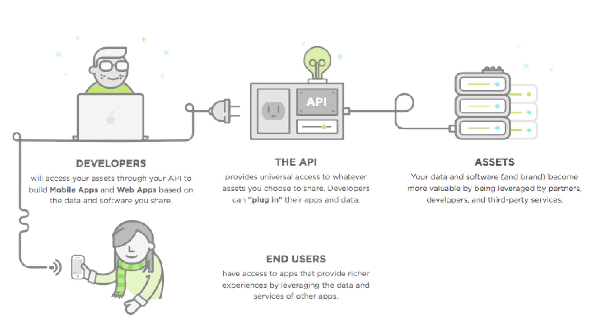
- **REST** (Representational State Transfer)
	- Regular way the internet works
	- Is about resources, not about functions
	- Is stateless
- **HTTP** (Hypertext Transfer Protocol)
	- HTTP verbs/methods
		- *POST* create
		- *GET* read
		- *PUT* update
		- *DELETE* delete
- **HTTP Request**
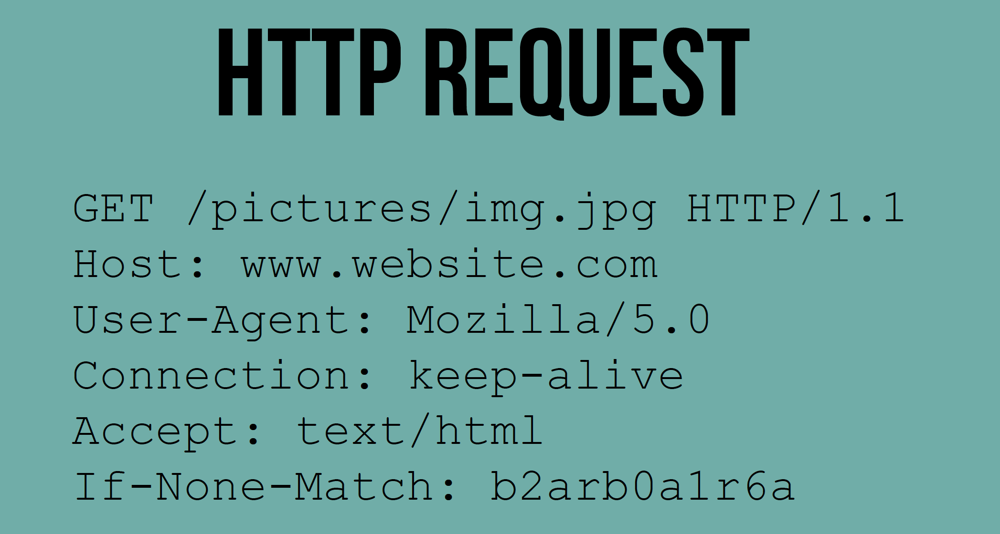
- **HTTP Response**
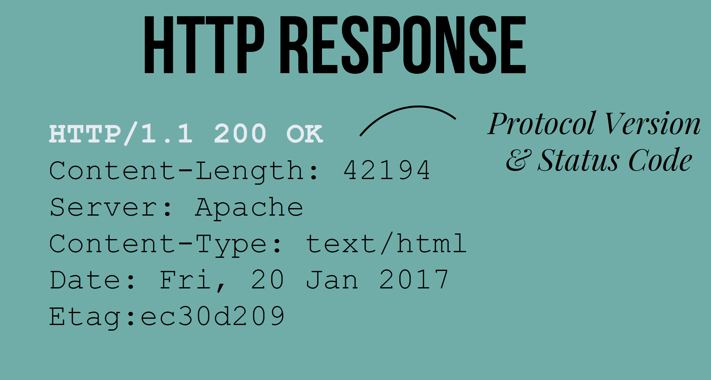
- **Restful Routes**
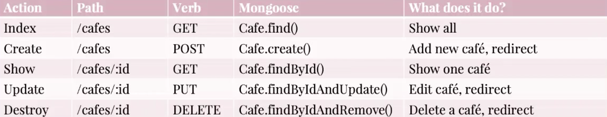


## Week 4 Lecture 2 MongoDB & Mongoose
- **MongoDB**
	- NoSQL: no transactions; no joins
	- Create and store objects. Arrange them in collections; Retrieve them later
	- Data store for JSON objects
- **MongoDB CRUD**
	- Create
		- `db.collection.insert(<document>)`
		- `db.collection.save(<document>)`
		- `db.collection.update(<query>, <update>, {upsert: true})`
	- Read
		- `db.collection.find(<query>, <projection>)`
		- `db.collection.findOne(<query>, <projection>)`
	- Update
		- `db.collection.update(<query>, <update>, <options>)`
	- Delete
		- `db.collection.remove(<query>, <justOne>)`
- **How to connect our app to MongoDB database**
	- Use mongoose
	- `var mongoose = require('mongoose')`
- **A whole view app**
	- under construction
- **Deploy Online**
	- Use heroku


## Week 5 Lecture 1 HTML & CSS
- Some material have been already covered in Week 2 Lecture 2
### HTML (Hyper Text Markup Language)
- `<element>` void element
- **Image and figure**
	- ``
	- It is better to separate the description and figure
		``` html
		<figure>
			
			<figcaption>The Barefoot Coffee Shop</figcaption>
		</figure>
		```
- **Lists**
	``` html
	<!-- Ordered list -->
	<ol>
		<li></li>
		<li></li>
		<li></li>
	</ol>
	<!-- Unordered list -->
	<ul>
		<li></li>
		<li></li>
		<li></li>
	</ul>
	```
- **Description Lists**
	``` html
	<dl>
		<dt></dt> <!-- term -->
		<dd></dd> <!-- description -->
		<dt></dt>
		<dd></dd>
	</dl>
	```
- **Generic Elements**
	- `<div>` block
	- `<span>` Inline
- **Identifying Elements**
	- `<div id="unique_id" class="class1 class2">`
		- id is unique but class is not
- **Tables**
	``` html
	<table>
		<tr>
			<th>Item</th>
			<th>Size</th>
			<th>Price</th>
		</tr>
		<tr>
			<td rowspan="3">Espresso</td>
			<td>Small</td>
			<td>$2.50</td>
		</tr>
		<tr>
			<td>Medium</td>
			<td>$3.00</td>
		</tr>
		<tr>
			<td>Large</td>
			<td>$3.50</td>
		</tr>
	</table>
	```
- **Links**
	- `a href="http://www.kofster.com">Kofster</a>`
	- Absolute URLs
		- `<a href="http://www.kofster.com/home">`
	- Relative
		- `<a href="/home">`
		- `<a href="#tag_id">`
- **Forms**
	- `<form action="/myaction" method="post">`
		``` html
		<form action="/myaction" method="post">
			Username:
			<input type="text" name="username"><br>
			Email:
			<input type="email" name="email"><br>
			Password:
			<input type="password" name="psw"><br>
			<input type="submit">
		</form>
		```
### CSS (Cascading Style Sheets)
- Inline
	``` html
	<h1 style="color:blue">Hello!</h1>
	```
- Internal
	``` html
	<head><style>
		h1{color:blue}
	</style></head>
	```
- External File
	``` html
	<head>
		<link rel="stylesheet" href="styles.css">
	</head>
	```
- **Selectors**
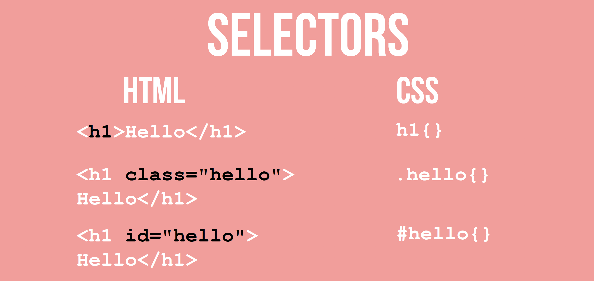
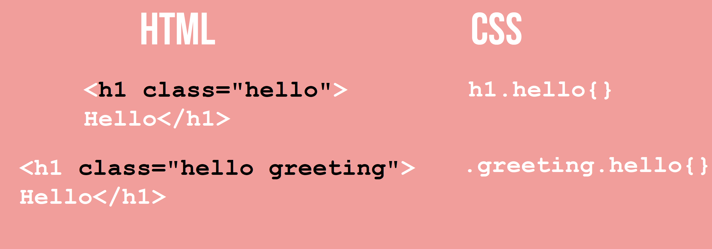
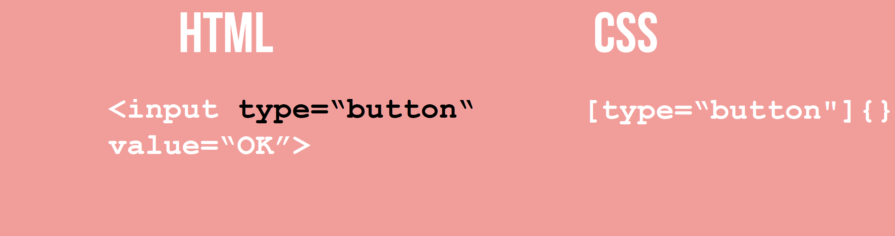
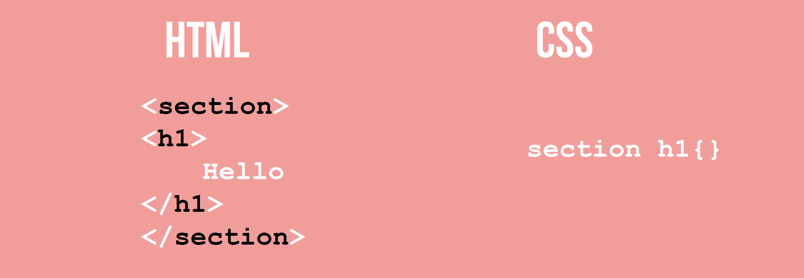
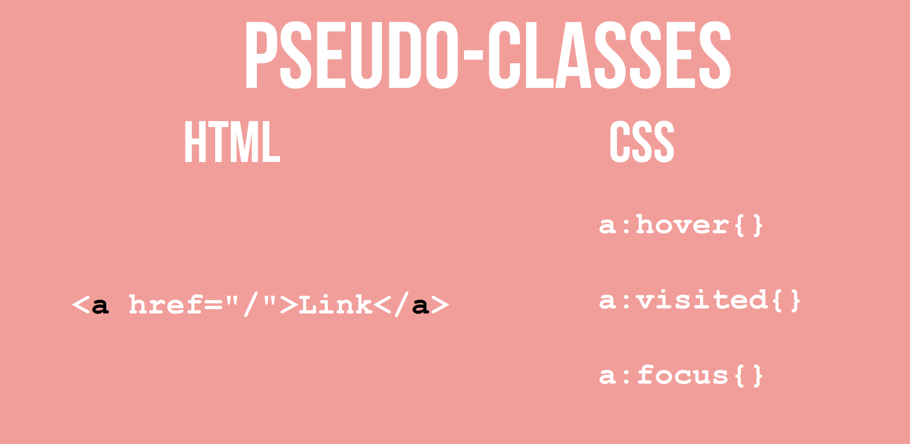
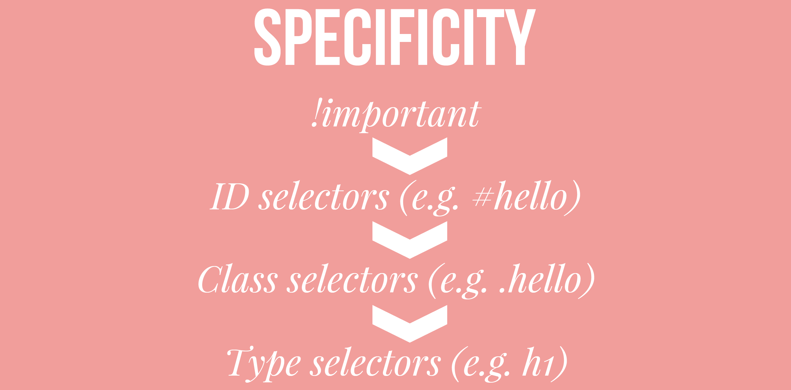
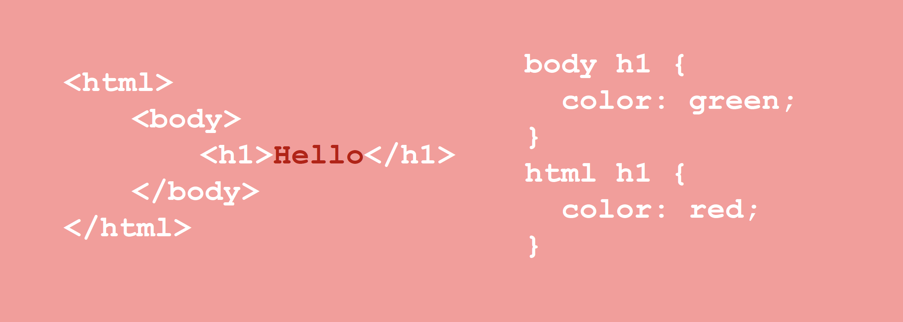
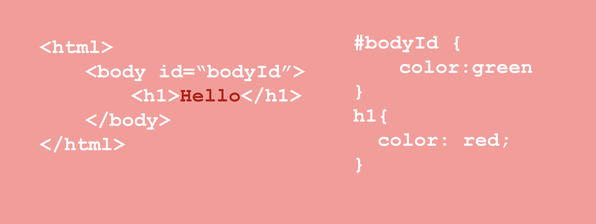

## Week 5 Lecture 2 Design Principle: Layout, Typography, Colour (Not Examinable)
- Top 5 credibility factors
	1. Design Look
	2. Information Design & Structure
	3. Information Focus
	4. Company Motive
	5. Usefulness of the information

- Basic Tools of Graphic Design
	- Colour
	- Layout
	- Typography

### Layout in CSS
- Benefits of Grids
	- Frameworks & Tools
	- Clean
	- Offer structure
	- Recognisable
- Rules for using Grids
	- Use size to determine order
	- Define space with colour
	- Be generous with whitespace
	- Think outside the grid
		- Advantage when we don't use grid: special and trendy
- Libraries and Frameworks
	- Bootstrap
	- CSS Grid
	- Flexbox

#### Box Model
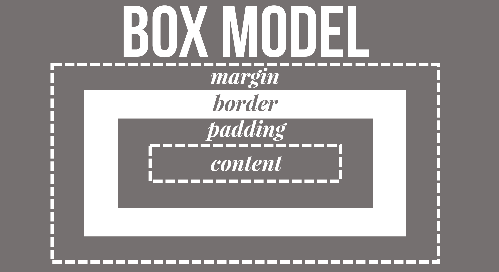
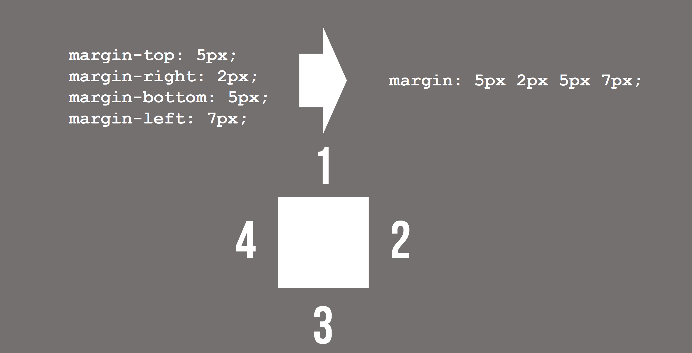
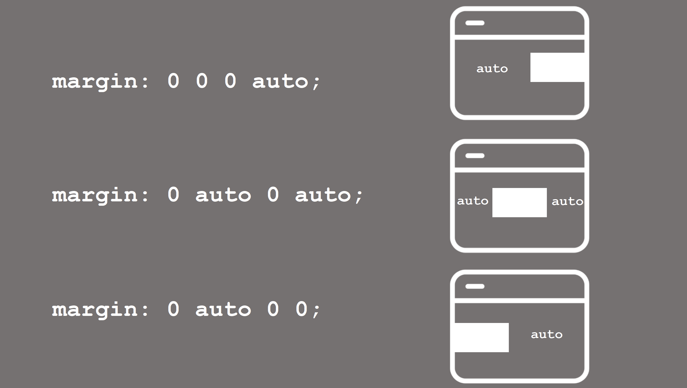
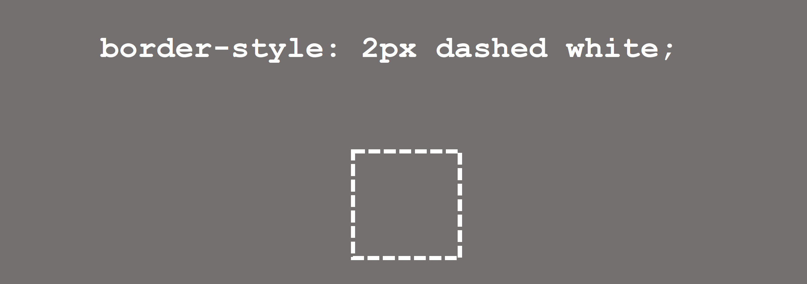
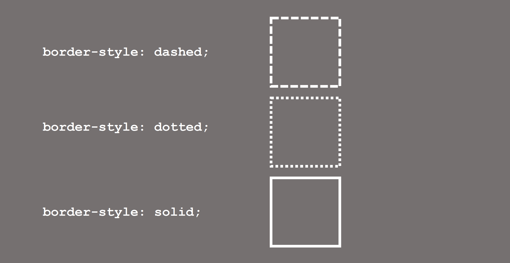
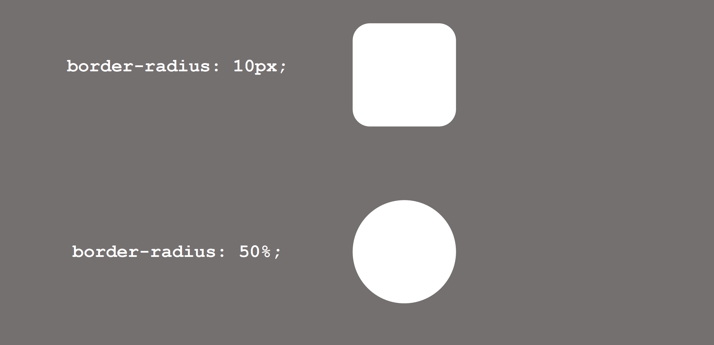


## Week 6 Lecture 1 Design Thinking (Not Examinable)
- How to understand users?
	- innovation process
		- Studies and Research: Identify users and investigates how the product can be used and in which circumstances
		- Ideation: Problems and opportunities identified by research inspires solutions, which is the goal of this phase
			- Brainstorm every idea that couldn't possibly work
			- Draw what you want to say
			- Write with your non-dominant hand
			- Collaborative fan
			- Use "dot-voting" to rank the ideas
			- Persona
			- Storyboard
			- mockups
		- Prototyping
		- Evaluation


## Week 6 Lecture 2 Usability
- What is usability?
	- Usability is a quality attribute that assesses how easy user interfaces are to use
	- The word "usability" also refers to methods for improving ease-of-use during the design process
- Usability can be defined by 5 quality components:
	- *Learnability*: How easy is it for users to accomplish basic tasks the first time they encounter the design?
	- *Efficiency*: Once users have learned the design, how quickly can they perform tasks?
	- *Memorability*: When users return to the design after a period of not using it, how easily can they reestablish proficiency
	- *Error*: How many errors do users make, how severe are these errors, and how easily can they recover from the errors?
	- *Satisfaction*: How pleasant is it to use the design?
- Web Usability
	- First Impressions
		- Grid, Layout etc.
	- Information Architecture
		- Card Sorting
	- Navigation
	- Form Design
		- Keep field to a minimum
		- Informative and visible labels
		- Easy to tap fields
		- Field size matching expected input
		- Specific error messages
		- Clearly mark what is optional
		- No reset! Usability testing
	- Dark Patterns
		- Force continuity
		- Friend spam
		- Hidden Costs
		- Trick Questions


## Week 7 Lecture 1 Responsive Design and Advanced JavaScript (Advanced JavaScript Not Examinable)
- What is responsive design?
	- Dealing with pixels
	- Display Resolution != Viewport Size. There is pixel density
	- DIP: Device-Independent Pixel
	- DIP = RES (Hardware Resolution) / DPR (Device Pixel Ratio)
		``` css
		<meta name="viewport"
		content="width=device-width, initial-scale=1">
		```
	**General Approaches:**
	1. Add some viewport tags or elements to each of the pages
	2. Use CSS Grid to organize content
	3. Choose breakpoint to decide when we reorganize the content using media queries
- CSS allows elements to overflow their container
	``` css
	img, embed, object, video {
		max-width: 100%;
	}
	body {
		font-size: 100%;
	}
	h1 {
		font-size: 5em;
	}
	```
- Media Queries
	``` css
	<link rel="stylesheet" href="styles.css">
	<link rel="stylesheet" media="screen and (min-width:500px;)" href="large.css">
	```
- Responsive Design Patterns
	- Column drop
	- Mostly Fluid
	- Layout Shifter
	- Off Canvas
- How to achieve responsive design pattern?
	- Using grid
		``` html
		<div class="container">
			<article></article>

			<div class="sidebar">
				<section>
					<header></header>
					<aside></aside>
				</section>
				<figure></figure>
			</div>
		</div>
		```
	- Container
	- Item
	- Line
	- Cell
	- Track
	- Area
	- Gap
		``` html
		<div class="page">
			<header></header>
			<figure></figure>
			<article></article>
			<aside></aside>
		</div>
		```
		``` css
		.page{
			display:grid;
			grid-template-columns: 2fr 1fr 1fr;
			grid-template-rows: 4em auto;
		}
		header {
			grid-row: 1/2;
			grid-column: 2/3;
		}
		figure {
			grid-row: 2/3;
			grid-column: 2/4;
		}
		article {
			grid-row: 1/2;
			grid-column: 1/3;
		}
		aside {
			grid-row: 1/2;
			grid-column: 3/4;
		}
		```
- No use of cell numbers
	``` css
	.page {
		display:grid;
		gird-template-columns: 2fr 1fr 1fr;
		grid-template-rows: 4em auto;
		grid-template-areas:
			"article header aside"
			"article figure figure";
	}
	header {
		grid-area: header;
	}
	figure {
		grid-area: figure;
	}
	article {
		grid-area: article;
	}
	aside {
		grid-area: aside;
	}
	```
- When design becomes responsive
	``` css
	.page {
		display:grid;
		gird-template-columns: 2fr 1fr 1fr;
		grid-template-rows: 4em auto;
		grid-template-areas:
			"article header aside"
			"article figure figure";
	}

	@media screen and (min-width: 992px) {
	.page {
		grid-template-columns: 1fr 3fr;
		grid-template-rows: 1fr 2fr auto;
		grid-template-areas:
			"header header"
			"figure figure"
			"aside article";
		}
	}
	```
- legacy browsers
	- Serve the mobile version to old browsers
		- Build the mobile version without grid
		- Test for grid support with `supports(display:grid)`


## Week 7 Lecture 2 API Client ES6, Sass, Babel (Sass & Babel Not Examinable)
- Template Engines for Node
	- JADE(PUG) with some Code Examples
	- VASH
	- EJS
	- MUSTACHE
	- DUST.JS
	- NUNJUCKS
	- HANDLEBARS
	- ATPL
	- HAML
- What can browser APIs do?
	- Fetching data (with AJAX - Asynchronous JavaScript And XML)
	- AJAX use XMLHttpRequest (XHR)
		- Object whose methods transfer data between a web browser and a web server
		- Some Code Examples
- Modern Web Stacks
	- MEAN - Angular
	- MERN - React


## Week 8 Security and Risk (Security Principles, Risk assessment)
- Black Hat and White Hat
	- Black Hat
		- Curious users
		- Thrill seeker
		- Trophy hunter
		- Script kiddies
		- Political activists
		- Professional
- Hashing + Salt
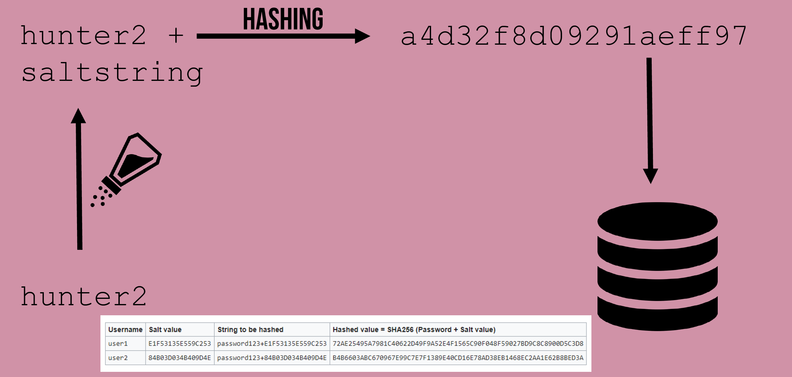
- Social Engineering
- Security Principles
	1. Expect The Worst - Focus on prevention instead of reaction
	2. Least Privilege - Minimum necessary to get the job done
	3. Simple Is More Secure - The more complex the system, the harder it is to secure
	4. Defense In Depth - Use layered security mechanisms
	5. No Security In Obscurity - Secrets are hard to keep
	6. Fail Security - Don't help your hackers
- Best Practices
	- Regulate requests
	- Validate input
	- Sanitise data
	- Keep code private
	- Vague security errors
- Types of attack
	- Confidentiality Attacks
	- Integrity Attacks
	- Availability Attacks
	- Authenticity Attacks
- Risk Assessment
	- Risk: An undesirable event with the potential to have a negative impact on the project
	- Trigger: An event that provides noticeable signs for the group that the risk may actually be happening
	- Likelihood: Chance of the risk occurring, rated on the likely, possible or unlikely
	- Impact: Extend to which the group will suffer as a result of risk occurring, rated as major, moderate or minor
	- Contingency Plan: What to do in the event of the risk actually happening
- Managing Risk
	- Prevention
	- Detection
	- Response
	- Recovery and Remediation
- Common Web Attacks
	- SQL Injection
		- Solution: Give limited privilege to the user; sanitise the input
	- URL Manipulation / Rewrite
		- `http://bank.com/autherise?Id=23482345`
		- Solution: Even unlinked pages are accessible, don't rely on obscurity as access control
	- XSS Cross-Site Scripting
		- Solution: Sanitise anything that gets output to the browser
	- CSRF (Cross-Site Request Forgery)
		- Solution: GET requests should be idempotent; Check for POST requests
	- Cookie Theft
		- With JavaScript, a cookie can be created like this: `document.cookie = "username=John Doe";`
		- You can also add an expiry data (in UTC time). By default, the cookie is deleted when the browser is closed: `document.cookie = "username=John Doe; expires="Thu, 18 Dec 2013 12:00:00 UTC";`
		- With a path parameter, you can tell the browser what path the cookie belongs to. By default, the cookie belongs to the current page. `document.cookie = "username=John Doe; expires=Thu, 18 Dec 2013 12:00:00 UTC; path=/";`
		- Solution: Assume cookies are visible; Non-sensitive data in cookies; HttpOnly; SSL; Set cookie expiration, domain & path


## Week 9 Lecture 1 Testing
- Why testing?
	- Error Free Code
	- Predictable
	- Resilient
- How to do testing?
	- Test-driven development(TDD) & Behaviour-driven development(BDD)
- Basic Test Cycle
	- Write Tests
	- Run Tests - Check for fails
	- Implement Functionality
	- Refactor
	- Repeat
- Frameworks and Tools for Node
	- Mocha
	- Chai
	- Sinon
	- Istanbul
- Test Types
	- Unit
	- Integration
	- Functional
- Getting Started with Mocha
	- Install: `npm install mocha` `npm install --save-dev mocha`
	- Use *test* directory to keep things clean
	- Mocha - Unit Testing Example
		``` js
		var assert = require('assert');
		describe('Mocha Test Example 1', function () {
			it('checking the sum of two numbers - PASS', function () {
				var sum = 1 + 2;
				assert.strictEqual(sum, 3);
			});
			it('check the length of a string - FAIL', function () {
				assert.strictEqual("mocha".length, 6);
			});
		});
		```
		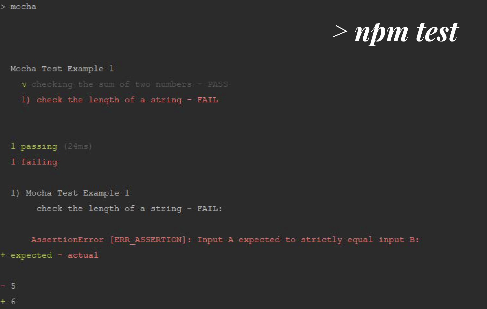
- Using Chai Assertion Library
	- TDD/BDD assertion library
	- Pair with any JS testing framework
	- Install: `npm install chai`
- Mocha-Chai Unit Testing
	- Testing the *findSum(n1, n2)* function
		``` js
		// defined in controllers/sum.js
		const findSum = function (n1, n2) {
			return n1 + n2;
		};

		module.exports = {
			findSum,
		};
		```
	- Test Cases:
		1. Test without arguments
		2. Test with valid arguments
		3. Test with invalid arguments
	- Chai Assertion Styles - Three Styles:
		1. assert - similar to node.js built-in assert
		2. expect - BDD style
		3. should - BDD style (requires a function)
		``` js
		var sum = require('../controllers/sum');
		var expect = require('chai').expect;

		describe('#testing the findSum() function', function() {

			context('test without arguments', function() {
				it('findSum() should throw error', function() {
					expect(function() {
						sum.findSum()
					}).to.throw(TypeError, 'findSum() expects numbers.')
				})
			})

			context('test with two arguments', function() {
				it('findSum(n1, n2) should return sum of n1 and n2', function() {
					expect(sum.findsum(1, 2)).to.equal(3)
				})
			})

			context('test with non-number arguments', function() {
				it('findSum(?,?) should throw error', function() {
					expect(function() {
						sum.findSum('a','b')
					}).to.throw(typeError, 'findSum() expects numbers.')
				})
			})
		})
		```
		
	- Implement a new *findSum()*
		``` js
		// defined in controllers/sum.js
		const findSum = function (n1, n2) {

			if (isNaN(n1) || isNaN(n2)) {
				throw new Typeerror('findSum() expects numbers.');
			}
			return n1 + n2;
		};

		module.exports = {
			findSum,
		};
		```
		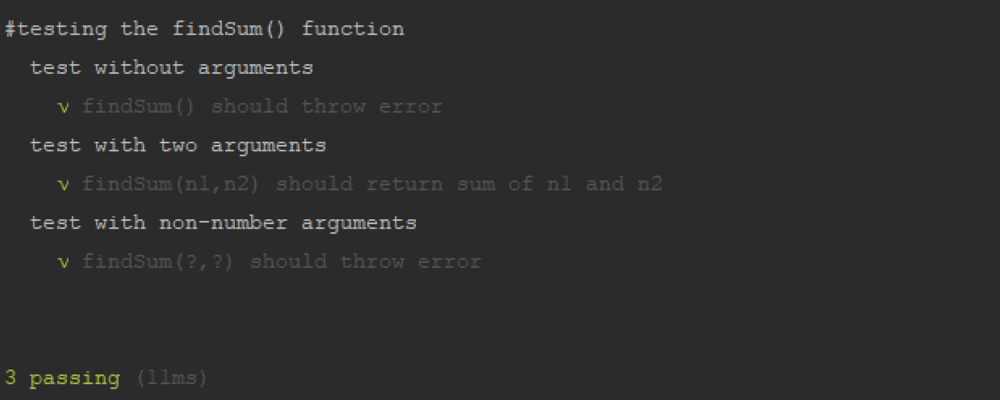
- Mocha - Integration Testing Example
	``` js
	var expect = require('chai').expect;
	var request = require('supertest');
	var app = require('../app');

	describe('Integration Test Example - Sum functionality', function() {
		describe('#POST to /calcs/sum with two numbers', function() {
			it('should get sum of two 1.5 and 2.3 as 3.8', function(done) {
				request(app)
					.post('/calcs/sum')
					.send({num1 : 1.5, num2 : 2.3})
					.end(function(err, res) {
						expect(res.statusCode).to.equal(200); //OK
						// This is only an example. You can use JSON for parsing
						expect(res.text).to.contains('<p><h1><b>Sum</b> is 3.8</h1></p>');
					});
			});
		});
	});
	```
	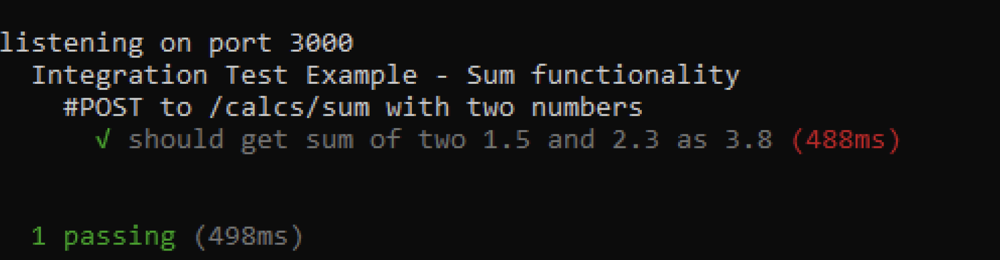
- Test Double Types
	- Spy: Wrapper for a real function
	- Mock: spy object that pretends to be a real function that can record information , e.g. how many times it's called, etc
	- Stub: is a spy with the real function replaced with behavior you specify
- Sinon
	- Library of test doubles
- Code Coverage
	- Code quality metric
	- How much was actually executed during tests
	- Strive for 100% coverage
- Istanbul
	- Library for testing code coverage
	- Usage:
		- `npm install -g Istanbul`
		- `istanbul cober test.js`
		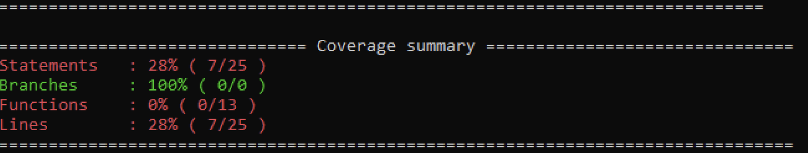
- Test Hooks
	- before
	- beforeEach
	- after
	- afterEach


## Week 9 Lecture 2 First Exam Review
### **Type of Questions**
 8 - 10 Questions including: Multiple Choice, Short Answers, Long Answers
### **Some Example Questions**
#### **Multiple Choice Questions**
- Inside which HTML element do we put the JavaScript
	- <Script\>
- How to change the HTML element below using JavaScript?  `<p id="demo">This is just a demo for you</p> `
	- `document.getElementById("demo").innerHTML = "Hello"`
#### **Short Answers Questions**
- List three git commands to a. Clone a repository b. Add a file to staging area c. Commit a file
	- a. git clone http://www.github.com/libgit2/libgit2.git
	- b. git add *.c
	- c. git commit -m "initialisation"
- What is XMLHttpRequest (XHR)
	- XMLHttpRequest(XHR) is an API in the form of object whose methods transfer data between a web browser and a web server
- State two reasons for testing your web-application
	- Error free. That is contain no (or at least possible number of) bugs
	- Predictable. We implement functionality to achieve certain tasks. We want to make sure that when we execute a functionality, the outcomes as we intended to be, not only the first time but always
	- Resilient to changes. That is be able to handle changes to functionality. Over the life of our web application, we will either enhance existing functionality or implement new ones. When we change a functionality, we can re-run all of our tests to ensure that other components (e.g. functions or classes) that may be dependent on the changed components continues to function as we intended
- Given the following HTML&CSS, what the colour of "Hello"
	``` html
	 <html>
		 <body class="red">
			 <h1 class="blue">
				 Hello
			 </h1>
		 </body>
	 </html>
	```
	``` css
	.blue {
		color: blue;
	}
	.red {
		color: red;
	}
	```

- Use the following incomplete tests to answer the two questions that follow. Write the missing assertion statement for testing the value of the variable *prod*, which is expected to be equal to *2.2*
	``` javascript
	var assert = require('assert');
	describe('Mocha Test', function() {
		it('checking the product of two numbers', function() {
			var prod = 1.0 * 2.2;
			// Missing assertion
		});
		it('check the length of a string', function() {
			assert.strictEqual("mocha".length, 5);
		});
	});
	```
	 `assert.strictEqual(prod, 2.2);`
 #### **Long Answers Questions**
- Question 1

- Question 1 Answer

- Question 2

- Question 2 Answer


## Week 10 Lecture 1 Expanding your Reach (SEO, Accessibility)
- How to evaluate a webpage
	- Content
	- Links to the page (backlinks)
	- Code implementation
	- Authority
	- And many more features!
- SEO
	- Organic Search (64%)
	- Social Media (2%)
	- Non-Social Referrals (15%)
	- Paid Listing (e.g. Google Adwords) (6%)
	- Direct (12%)
- Keywords
	- Specific > Popular
	- Distribution
	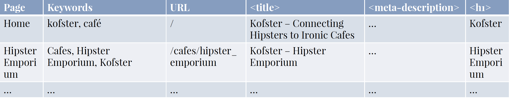
		- Page: Every page in your site
		- Keywords: Keywords being targeted
		- URL: URL or the page
		- <title\>: Title (< 65 chars)
		- <meta-description\>: Meta description (<160 chars)
		- <h1\>: H1 Heading
- URL Optimization
	- www.kofster.com/cafes/12937452918491827304
	- e.g. the number in URL is MongoDB id
	- Change to Useful info about the page: www.kofster.com/cafes/hipster_emporium
- HTML Tags Optimisation
	- `<title>` Heading in the SERP
	- `<meta name="description">` Summary in the SERP
	- `<h1>` Stick to one per page
- IMG Optimisation
	- ``
	-  Change to `` to combine with surrounding text
- SEO Tools
- Microformats
	- Special syntax to identify types of content
- Accessibility Tips
	- Define the Language
		- `<html dir="ltr" lang="en-AU">`
	- Use Semantic Tags
		- `<small>` Legalese (e.g. copyright, T&C)
		- `<cite>` e.g. Point to source of quote
		- `<abbr>` Acronyms and abbreviations
	- Create Hierarchies with Heading Levels
		- `<h1><h2><h3><h4><h5><h6>`
	- Markup Links
		 ``` html
		 <a href="http://unimelb.edu.au">Unimelb</a>
		 ```
		 Change to
		 ``` html
		 <a href="http://unimelb.edu.au" title="University of Melbourne Home Page">Unimelb</a>
		 ```


## Week 10 Lecture 2 Localisation & Internationalisation
- Localisation: Adaptation to meet the language, cultural, and other requirements of a specific target market.
- Internationalisation: Design and development that support localisation
	- Think about: Language, Direction, Units, Local Regulations, Sizing(paper, shoes, clothes), Devices, Browsers, Social Media, Currency, etc.
- Locale = language + region + preferences
- Keep Code and Content separate from each other
- Localisation > Translation
- Currency Issue
	- Display price in local currency
	- Follow local tax regulations
	- Localise your pricing structure
- Language Case Example
	- A directory/locales contains: en_AU.json; en_US.json; fr_FR.json
	- EN_AU.JSON:
		``` json
		{
			"hello" : "G'Day!"
		}
		```
	- EN_US.JSON:
		``` json
		{
			"hello" : "Good Morning!"
		}
		```
	- FR_FR.JSON
		``` json
		{
			"hello" : "Bonjour!"
		}
		```
- A locale repository stores:
	- Strings in your code
	- External text
	- Text in interface widgets
	- String context notes
- Careful when treating text programmatically
	- Deal with plural issue
- Fonts
	- Does it support all chars needed?
	- Support for right set of chars?
	- Is it culturally appropriate?
- Left-to-Right or Right-to-Left
	- `dir="ltr"` or `dir="rtl"`
- Different meaning of colours
- Attention to detail
- **From the start:**
	- **Identify your target locales**
	- **Refactor the code**
	- **Test for each locale**
- Localisation Management Software
	- Content repo
	- Translation memory
	- Collaboration tools
	- Automatic translation


## Week 11 Lecture 1 Future of The Web (Not Examinable)


## Week 11 Lecture 2 Web of things (Not Examinable)


## Week 12 Lecture 1 Project Showcase
- No New Content


## Week 12 Lecture 2 Second Exam Review
- Go over the sample exam paper
